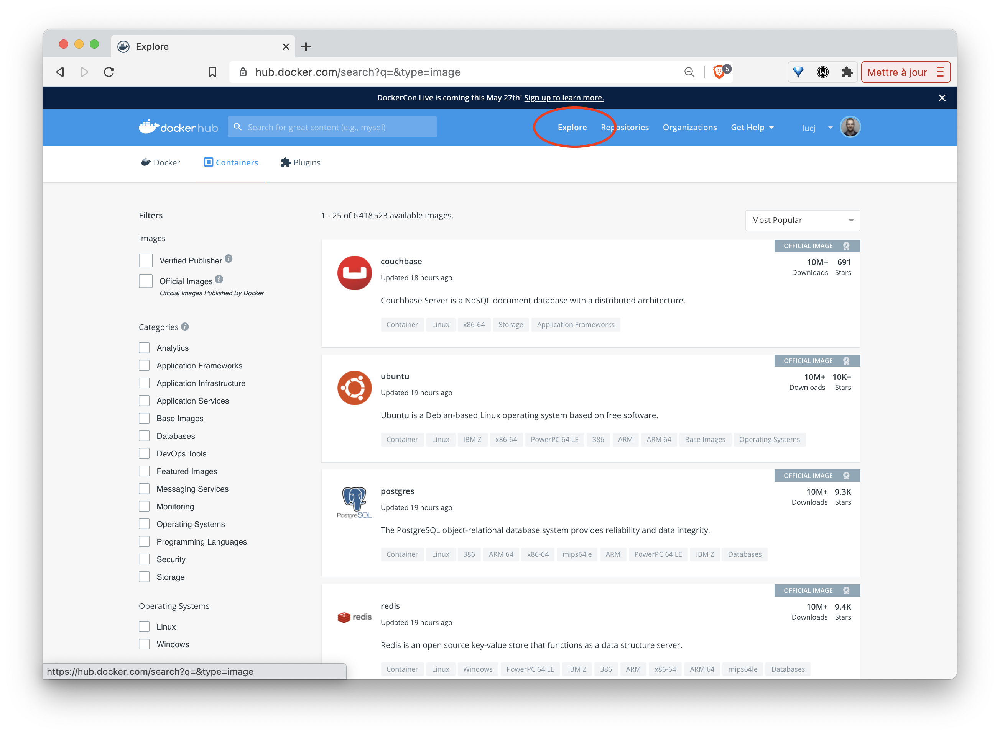
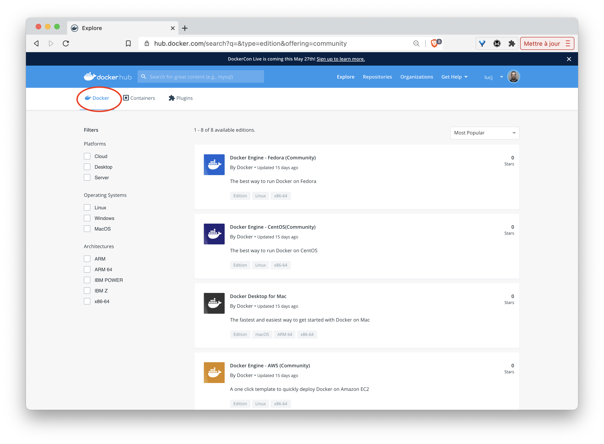

Nous allons voir ici comment installer Docker sur votre environnement.

## Docker Hub: le point d'entrée de l'ecosystème Docker

Rendez-vous tout d'abord dans le Docher Hub: [https://hub.docker.com](https://hub.docker.com) puis sélectionner l'onglet *Explore*:



Sélectionnez ensuite l'onglet *Docker* dans le sous menu:



Sur la gauche vous verrez alors un menu vous permettant de sélectionnner différents éléments:
- plateforme
- système d'exploitation
- architecture

Comme nous pouvons le constater, Docker peut être installé sur des systèmes divers: machine de développement, l'infrastructure d'un cloud provider, et même des devices de type Raspberry PI. 

- Si vous êtes sur MacOS ou Windows 10 (Entreprise ou Pro) vous pouvez installer *Docker Desktop* un environnement très intégré pour chacune de ces plateformes:

  * Docker Desktop for Mac: https://hub.docker.com/editions/community/docker-ce-desktop-mac
  * Docker Desktop for Windows: https://hub.docker.com/editions/community/docker-ce-desktop-windows

  Vous aurez alors un lien de téléchargement pour chacun de ces produits et quelques explications complémentaires.

- Si vous êtes sur Linux, vous pouvez sélectionner la distribution que vous utilisez (Fedora, CentOS, Ubuntu, Debian) et vous obtiendrez alors un lien vers la documentation à suivre pour installer Docker sur la distribution en question.

Pour aller un peu plus vite, vous pouvez également lancer la commande suivante (compatible avec les principales distribution Linux) 

```
$ curl -sSL https://get.docker.com | sh
```

En quelques dizaines de secondes, cela installera la plateforme Docker sur votre distribution.

Il sera ensuite nécessaire d'ajouter votre utilisateur dans le groupe *docker* afin de pouvoir intéragir avec le daemon sans avoir à utiliser *sudo* (il faudra cependant lancer un nouveau shell afin que ce changement de groupe soit pris en compte.)

```
$ sudo usermod -aG docker UTILISATEUR
```

- Il est également possible d'installer Docker sur d'autres types d'architecture / infrastructure

## Vérification

Une fois installé, lancez la commande suivante afin de vérifier que tout est ok.

```
$ docker info
```

Vous devriez obtenir un résultat similaire à celui ci-dessous (il y aura cependant des différences en fonction de l'environnement que vous utilisez).

```
Client:
 Context:    default
 Debug Mode: false
 Plugins:
  app: Docker App (Docker Inc., v0.9.1-beta3)
  buildx: Build with BuildKit (Docker Inc., v0.5.1-docker)

Server:
 Containers: 0
  Running: 0
  Paused: 0
  Stopped: 0
 Images: 0
 Server Version: 20.10.6
 Storage Driver: overlay2
  Backing Filesystem: extfs
  Supports d_type: true
  Native Overlay Diff: true
  userxattr: false
 Logging Driver: json-file
 Cgroup Driver: cgroupfs
 Cgroup Version: 1
 Plugins:
  Volume: local
  Network: bridge host ipvlan macvlan null overlay
  Log: awslogs fluentd gcplogs gelf journald json-file local logentries splunk syslog
 Swarm: inactive
 Runtimes: io.containerd.runc.v2 io.containerd.runtime.v1.linux runc
 Default Runtime: runc
 Init Binary: docker-init
 containerd version: 05f951a3781f4f2c1911b05e61c160e9c30eaa8e
 runc version: 12644e614e25b05da6fd08a38ffa0cfe1903fdec
 init version: de40ad0
 Security Options:
  apparmor
  seccomp
   Profile: default
 Kernel Version: 4.15.0-58-generic
 Operating System: Ubuntu 18.04.3 LTS
 OSType: linux
 Architecture: x86_64
 CPUs: 1
 Total Memory: 985.5MiB
 Name: vagrant
 ID: OH2D:I6NU:V2BX:7PHO:ZDZJ:TP74:ZYDM:DV4T:WW5V:SA5F:E5WU:HIRW
 Docker Root Dir: /var/lib/docker
 Debug Mode: false
 Registry: https://index.docker.io/v1/
 Labels:
 Experimental: false
 Insecure Registries:
  127.0.0.0/8
 Live Restore Enabled: false

WARNING: No swap limit support
```