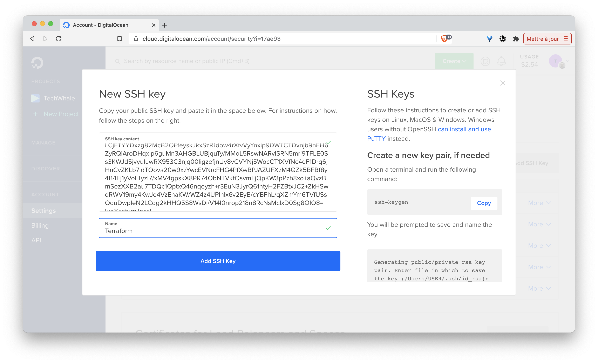
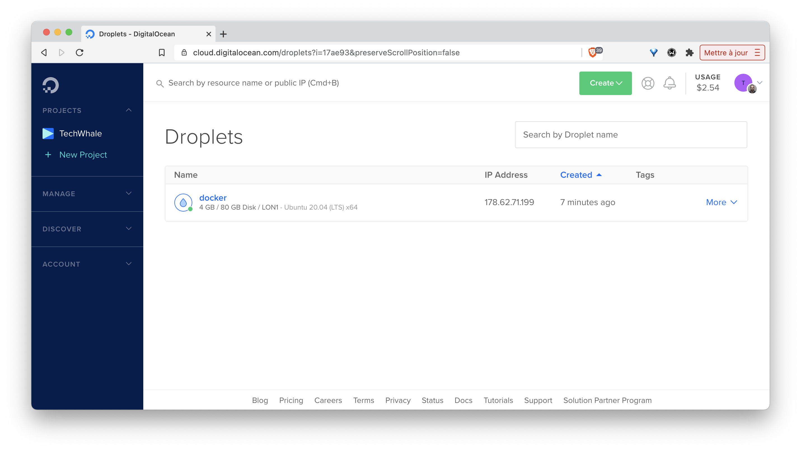

Dans cet exercice vous allez utiliser [Terraform](https://terraform.io) pour créer une machine virtuelle sur un cloud provider et installer Docker sur celle-ci.

Note: l'utilisation d'un cloud provider (DigitalOcean dans cet exemple) nécessite la création d'un compte au préalable et de le créditer de quelques euros.

## Quelques pré-requis

Pour provisionner un hôte Docker sur DigitalOcean, certains pré-requis sont nécessaires:

- il vous faut un compte sur [DigitalOcean](https://digitalocean.com)

- depuis l'interface web de DigitalOcean il faudra créer un Access Token, celui-ci vous permettra d'effectuer des actions via l'API de DigitalOcean. Pour générer un Access Token, il vous suffit de vous rendre dans le menu *API* puis dans l'onglet *Tokens/Keys*

- depuis l'interface web de DigitalOcean il faudra également créer une clé ssh, celle-ci vous permettra de vous connecter à votre VM (et permettra également à Terraform de configurer celle-ci). Pour créer une clé ssh, il vous suffit de vous rendre dans le menu *Settings* puis dans l'onglet *Security*. 

Depuis votre machine locale, créez un couple de clés avec la commannde ```ssh-keygen```. Ensuite, depuis l'interface web de digitalOcean, créez une clé nommé *terraform* en copiant la clé publique créée précédemment.

.

Vous utiliserez la clé privée un peu plus loin dans cet exercice afin de permettre à Terraform de se connecter à votre VM pour installer Docker.

## Quelques mots sur Terraform

Infrastructure as Code (IaC)

[Terraform](https://terraform.io) est un excellent outil de [Hashicorp](https://hashicorp.com), il est disponible pour Windows, Linux et Mac. Il permet de lancer des éléments d'infrastructure sur différents providers:
- cloud providers: AWS, GCP, DigitalOCean, Exoscale, ...
- providers locaux: VMWare, ...

Terraform repose sur la définition de fichiers de configuration écrits en HCL (Hashicorp Configuration Language) dans lesquels sont précisés les caractéristiques des éléments à créer.

L'installation de Terraform est très simple, il suffit de récupérer le binaire depuis le site officiel et de mettre celui-ci dans votre PATH.

## Fichier de configuration

Dans un nouveau dossier, créez le fichier *main.tf* avec le contenu suivant: 

```
terraform {
  required_providers {
    digitalocean = {
      source  = "digitalocean/digitalocean"
      version = "2.6.0"
    }
  }
  required_version = ">= 0.13"
}

variable "do_token" {}
variable "private_key {}

provider "digitalocean" {
  token = var.do_token
}

data "digitalocean_ssh_key" "terraform" {
  name = "terraform"
}

resource "digitalocean_droplet" "docker" {
  name     = "docker"
  image    = "ubuntu-20-04-x64"
  region   = "lon1"
  size     = "s-2vcpu-4gb"
  ssh_keys = [
    data.digitalocean_ssh_key.terraform.id
  ]
  connection {
    host = self.ipv4_address
    user = "root"
    type = "ssh"
    private_key = file(var.private_key)
    timeout = "2m"
  }
  provisioner "remote-exec" {
    inline = [
      "curl -sSL https://get.docker.com | sh"
    ]
  }
}

output "droplet" {
    value = digitalocean_droplet.docker.ipv4_address
}
```

Regardons cette configuration d'un peu plus près:

- le bloc *terraform* définit la version minimum de Terraform à utiliser ainsi que le provider dont nous avons besoin. Ici nous allons interagir avec l'infrastructure du cloud provider DigitalOcean

- nous définissons ensuite des variables qui seront utilisées dans la suite

- dans le bloc *provider*, nous spécifions le token utilisé pour communiquer avec l'API de DigitalOcean (ce token sera fournit via une variable)

- le bloc data permet de récupérer la clé ssh nommé *terraform*, il s'agit de la clé créée précédemment

- le bloc *resource* définit une ressource de type *digitalocean_droplet* (il s'agit d'une machine virtuelle de l'infrastructure de DigitalOcean) et précise tout d'abord les éléments de base nécessaires à sa création:
  * son nom
  * la version de Linux utilisé
  * la région dans laquelle cette VM sera créée
  * sa taille
  * le nom de la clé publique qui sera copiée dans *.ssh/authorized_keys*

- le sous bloc *connection* définit la façon dont Terraform se connectera à cette VM pour la configurer (ici via ssh en utilisant la clé privée correspondant à la clé publique copiée dans la VM)

- le sous bloc *provisioner* définit les commandes qui seront lancées pour configurer la VM, ici seule l'installation de Docker sera effectuée

## Création de la VM

La première chose à faire est de lancer la commande d'initialisation afin que Terraform puisse lire la configuration et installer les plugins dont il aura besoin:

```
$ terraform init
```

Nous pouvons alors ensuite lancer la création des ressources en utilisant la sous commande *apply* à laquelle nous fournissons:
- la valeur de l'Access Token (en supposant que celui-ci soit dans la variable d'env DO_TOKEN)
- le chemin d'accès à la clé privée locale

```
terraform apply -var do_token=$DO_TOKEN -var private_key=/Users/luc/.ssh/do_terraform
```

Terraform va alors communiquer avec l'API de DigitalOcean et lister les actions à réaliser. Vous devriez obtenir un résultat similaire à celui ci-dessous qui indique qu'une seule ressource va être créée (notre VM):

```
An execution plan has been generated and is shown below.
Resource actions are indicated with the following symbols:
  + create

Terraform will perform the following actions:

  # digitalocean_droplet.docker will be created
  + resource "digitalocean_droplet" "docker" {
      + backups              = false
      + created_at           = (known after apply)
      + disk                 = (known after apply)
      + id                   = (known after apply)
      + image                = "ubuntu-20-04-x64"
      + ipv4_address         = (known after apply)
      + ipv4_address_private = (known after apply)
      + ipv6                 = false
      + ipv6_address         = (known after apply)
      + locked               = (known after apply)
      + memory               = (known after apply)
      + monitoring           = false
      + name                 = "docker"
      + price_hourly         = (known after apply)
      + price_monthly        = (known after apply)
      + private_networking   = (known after apply)
      + region               = "lon1"
      + resize_disk          = true
      + size                 = "s-2vcpu-4gb"
      + ssh_keys             = [
          + "30202756",
        ]
      + status               = (known after apply)
      + urn                  = (known after apply)
      + vcpus                = (known after apply)
      + volume_ids           = (known after apply)
      + vpc_uuid             = (known after apply)
    }

Plan: 1 to add, 0 to change, 0 to destroy.

Do you want to perform these actions?
  Terraform will perform the actions described above.
  Only 'yes' will be accepted to approve.

  Enter a value: yes
...
```

Il est alors nécessaire d'indiquer que l'on est d'accord avec cette action en entrant *yes*. Cela déclenche alors la création de la VM, qui sera disponible au bout de quelques dizaines de secondes. 

Le résultat de Terraform nous fournit également l'adresse IP de la VM ainsi créée:

```
...
Outputs:

droplet = "178.62.71.199"
```

Vous pouvez également vérifier, depuis l'interface de DigitalOcean, que cette VM a bien été créée:



## Test

A partir de l'adresse IP de cette machine virtuelle vous pourrez alors vous connecter en ssh (avec l'utilisateur *root*) et vérifier que Docker est bien installé.

:fire: assurez-vous de bien vous connecter avec la clé privée que vous aviez créée précédemment (la clé publique correspondante ayant été copiée dans la VM lors de sa création)

```
$ ssh -i ~/.ssh/do_terraform root@178.62.71.199
Welcome to Ubuntu 20.04.1 LTS (GNU/Linux 5.4.0-51-generic x86_64)

 * Documentation:  https://help.ubuntu.com
 * Management:     https://landscape.canonical.com
 * Support:        https://ubuntu.com/advantage

  System information as of Sun May  2 13:40:11 UTC 2021

  System load:  0.0               Users logged in:          0
  Usage of /:   2.5% of 77.36GB   IPv4 address for docker0: 172.17.0.1
  Memory usage: 7%                IPv4 address for eth0:    178.62.71.199
  Swap usage:   0%                IPv4 address for eth0:    10.16.0.5
  Processes:    115               IPv4 address for eth1:    10.131.0.2

134 updates can be installed immediately.
63 of these updates are security updates.
To see these additional updates run: apt list --upgradable


Last login: Sun May  2 13:26:42 2021 from 2.15.157.115
root@docker:~# docker info
Client:
 Context:    default
 Debug Mode: false
 Plugins:
  app: Docker App (Docker Inc., v0.9.1-beta3)
  buildx: Build with BuildKit (Docker Inc., v0.5.1-docker)

Server:
 Containers: 0
  Running: 0
  Paused: 0
  Stopped: 0
 Images: 0
 Server Version: 20.10.6
 Storage Driver: overlay2
  Backing Filesystem: extfs
  Supports d_type: true
  Native Overlay Diff: true
  userxattr: false
 Logging Driver: json-file
 Cgroup Driver: cgroupfs
 Cgroup Version: 1
 Plugins:
  Volume: local
  Network: bridge host ipvlan macvlan null overlay
  Log: awslogs fluentd gcplogs gelf journald json-file local logentries splunk syslog
 Swarm: inactive
 Runtimes: io.containerd.runc.v2 io.containerd.runtime.v1.linux runc
 Default Runtime: runc
 Init Binary: docker-init
 containerd version: 05f951a3781f4f2c1911b05e61c160e9c30eaa8e
 runc version: 12644e614e25b05da6fd08a38ffa0cfe1903fdec
 init version: de40ad0
 Security Options:
  apparmor
  seccomp
   Profile: default
 Kernel Version: 5.4.0-51-generic
 Operating System: Ubuntu 20.04.1 LTS
 OSType: linux
 Architecture: x86_64
 CPUs: 2
 Total Memory: 3.844GiB
 Name: docker
 ID: 2QKL:WJTR:Z3EI:PAAD:3ZIJ:SGNJ:DEJ2:VGVB:3ARB:XHY6:QNS6:IW3R
 Docker Root Dir: /var/lib/docker
 Debug Mode: false
 Registry: https://index.docker.io/v1/
 Labels:
 Experimental: false
 Insecure Registries:
  127.0.0.0/8
 Live Restore Enabled: false

WARNING: No swap limit support
```

Vous avez donc créez une machine virtuelle et installez Docker dans celle-ci avec [Terraform](https://terraform.io), un outils que je vous recommande fortement de regarder un peu plus en détails.

## Cleanup

Afin de supprimer la VM, utiliser la sous-commande *destroy* en utilisant les memes valeurs pour les variables:

````
$ terraform destroy -var do_token=$DO_TOKEN -var private_key=/Users/luc/.ssh/do_terraform
```

Comme précédement, il faudra confirmer la demande de suppression:

```
An execution plan has been generated and is shown below.
Resource actions are indicated with the following symbols:
  - destroy

Terraform will perform the following actions:

  # digitalocean_droplet.docker will be destroyed
  - resource "digitalocean_droplet" "docker" {
      - backups              = false -> null
      - created_at           = "2021-05-02T13:26:06Z" -> null
      - disk                 = 80 -> null
      - id                   = "244242053" -> null
      - image                = "ubuntu-20-04-x64" -> null
      - ipv4_address         = "178.62.71.199" -> null
      - ipv4_address_private = "10.131.0.2" -> null
      - ipv6                 = false -> null
      - locked               = false -> null
      - memory               = 4096 -> null
      - monitoring           = false -> null
      - name                 = "docker" -> null
      - price_hourly         = 0.02976 -> null
      - price_monthly        = 20 -> null
      - private_networking   = true -> null
      - region               = "lon1" -> null
      - resize_disk          = true -> null
      - size                 = "s-2vcpu-4gb" -> null
      - ssh_keys             = [
          - "30202756",
        ] -> null
      - status               = "active" -> null
      - tags                 = [] -> null
      - urn                  = "do:droplet:244242053" -> null
      - vcpus                = 2 -> null
      - volume_ids           = [] -> null
      - vpc_uuid             = "ef4da5fd-41f0-434e-a540-ea671793c957" -> null
    }

Plan: 0 to add, 0 to change, 1 to destroy.

Changes to Outputs:
  - droplet = "178.62.71.199" -> null

Do you really want to destroy all resources?
  Terraform will destroy all your managed infrastructure, as shown above.
  There is no undo. Only 'yes' will be accepted to confirm.

  Enter a value: yes

digitalocean_droplet.docker: Destroying... [id=244242053]
digitalocean_droplet.docker: Still destroying... [id=244242053, 10s elapsed]
digitalocean_droplet.docker: Still destroying... [id=244242053, 20s elapsed]
digitalocean_droplet.docker: Destruction complete after 24s

Destroy complete! Resources: 1 destroyed.
```