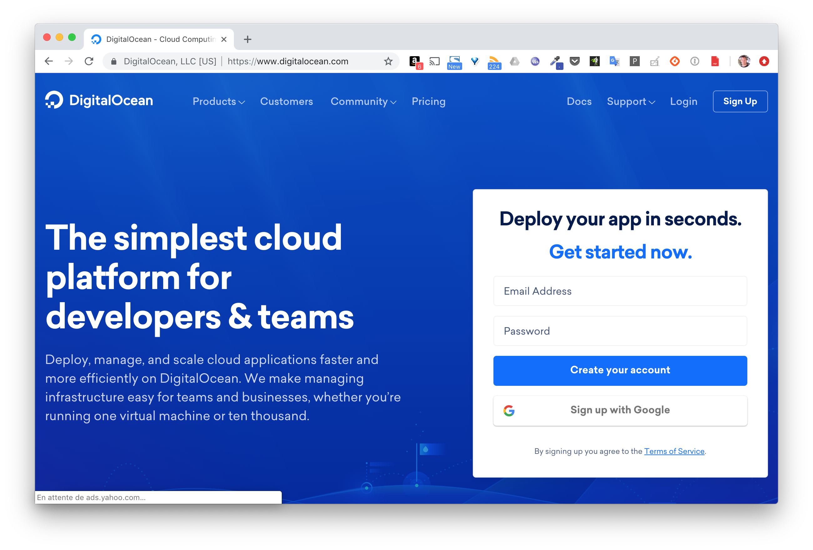
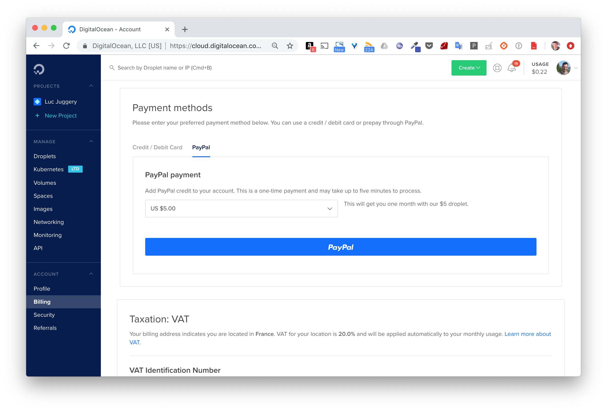
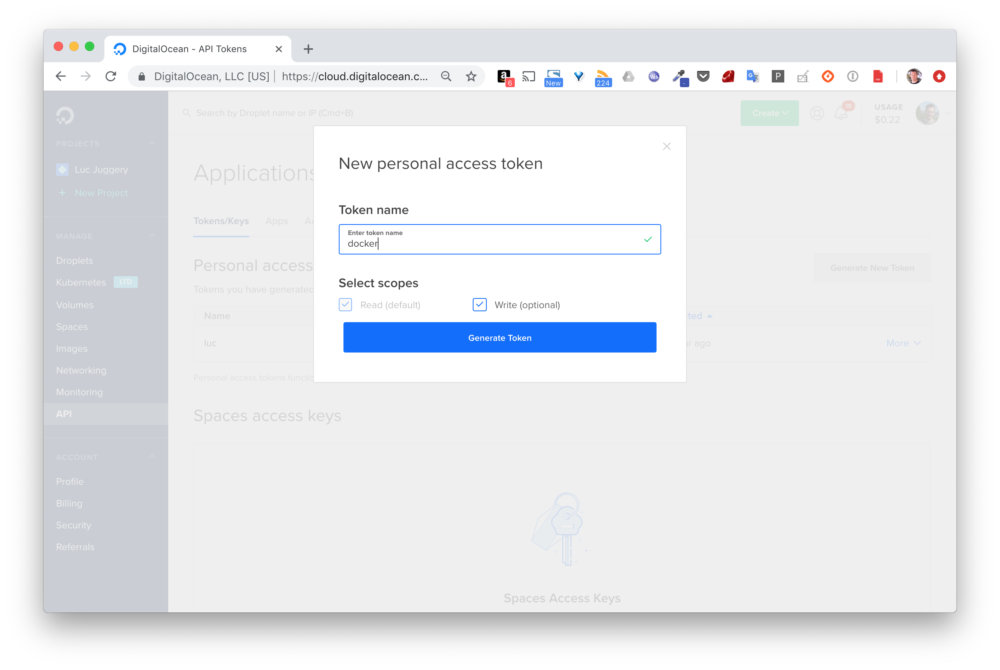
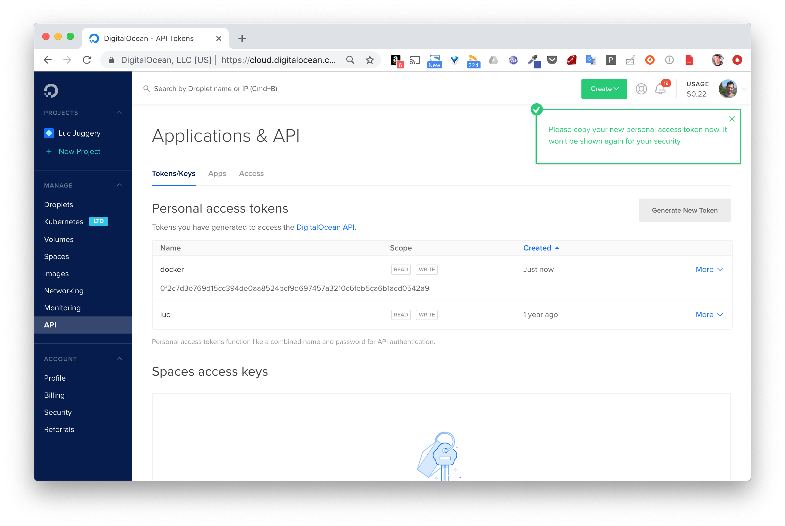
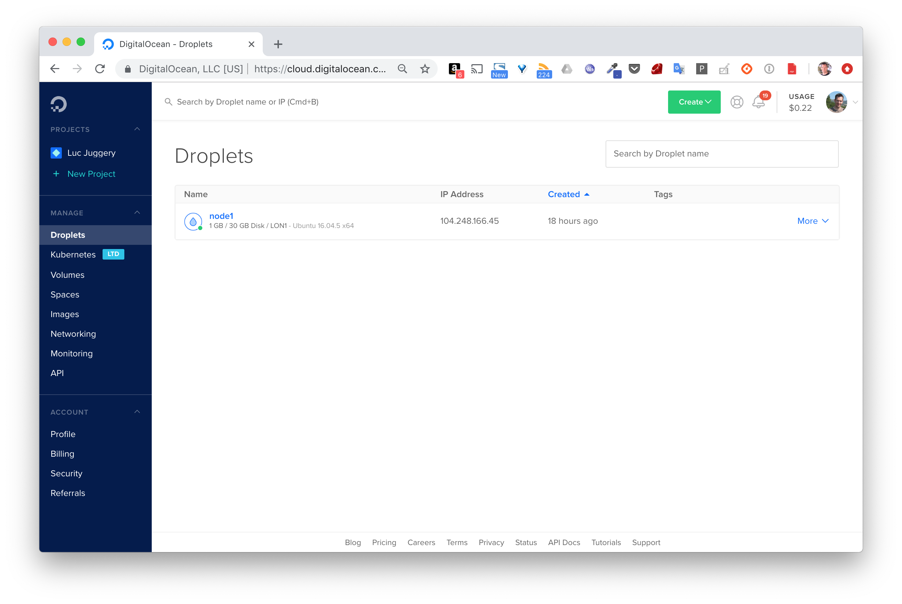
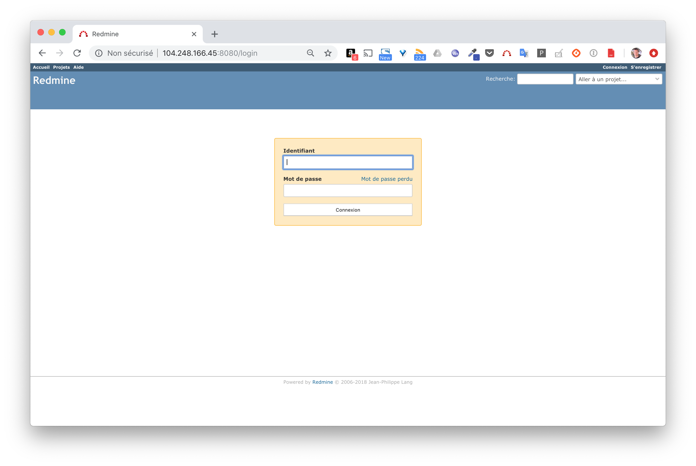

Dans cette mise en pratique, nous allons créer un hôte Docker sur le cloud provider [DigitalOcean](https://digitalocean.com). Cela permettra d'y déployer des applications et de les rendre disponibles pour tout le monde.

> Attention, cet exercice est optionel car l'utilisation de DigitalOcean (comme de l'ensemble des cloud providers) est payante. Vous pouvez suivre cet exercice pour comprendre comment l'on utilise DigitalOcean avec Docker Machine mais vous n'êtes pas obligé de créer un compte si vous ne le souhaitez pas.


## Creation d'un compte

Rendez-vous sur [DigitalOcean](https://digitalocean.com) et cliquez sur Signup en haut à droite.



## Provisionnez votre compte

Une fois votre compte créé, il vous faudra le provisionner, seulement quelques euros suffiront. Il n'est pas nécessaire de renseigner une carte bleue, le provisionning pouvant également se faire via Paypal.



## Création d'un hôte Docker

Afin d'utiliser Docker-Machine avec *DigitalOcean*, il faut commencer par créer un token qui permettra d'authentifier les appels à l'API. La création de ce token ce fait en cliquant sur *Generate New Token* depuis le menu *API* sur la gauche.





Sauvez ce token dans la variable d'environnement TOKEN. Avec celui-ci, vous allez à présent pouvoir créer un hôte Docker avec Docker Machine. Il suffira de préciser les paramètres suivants:
- le driver à utiliser: *--driver digitalocean*
- le token d'authentification: *--digitalocean-access-token $TOKEN*

Lancez alors la commande suivante:

```
$ docker-machine create --driver digitalocean --digitalocean-access-token $TOKEN node1
```

Vous obtiendrez un résultat, similaire à celui ci-dessous, détaillant le process de création de la machine.

```
Running pre-create checks...
Creating machine...
(node2) Creating SSH key...
(node2) Creating Digital Ocean droplet...
(node2) Waiting for IP address to be assigned to the Droplet...
Waiting for machine to be running, this may take a few minutes...
Detecting operating system of created instance...
Waiting for SSH to be available...
Detecting the provisioner...
Provisioning with ubuntu(systemd)...
Installing Docker...
Copying certs to the local machine directory...
Copying certs to the remote machine...
Setting Docker configuration on the remote daemon...
Checking connection to Docker...
Docker is up and running!
To see how to connect your Docker Client to the Docker Engine running on this virtual machine, run: docker-machine env node1
```

Une fois la machine créée, assurez vous qu'elle soit bien listée par Docker Machine. Vous obtiendrez un résultat similaire à celui ci-dessous (l'adresse IP attribuée sera cependant différente).

```
$ docker-machine ls
NAME   ACTIVE DRIVER        STATE    URL                       SWARM  DOCKER   ERRORS
node1  -      digitalocean  Running  tcp://104.248.166.45:2376        v18.09.1
```

La machine que nous venons de créer est aussi visible depuis l'interface web de DigitalOcean dans le menu *Droplet* (c'est le nom donné à une machine virtuelle tournant sur l'infra de DigitalOcean)



Par défaut, la machine virtuelle créée est basée sur Ubuntu 16.04. Lors de l'étape de création, il est toutefois possible d'utiliser des options supplémentaires afin de modifier ce comportement par défaut. La liste des options est disponible à l'adresse suivante: [Options du driver DigitalOcean](https://docs.docker.com/machine/drivers/digital-ocean/#options).

Note: attention néanmoins de ne pas utiliser de machines surdimensionnées afin de ne pas épuiser votre crédit trop rapidement :)


Vous pouvez à présent vous connecter à la machine en ssh (avec ```docker-machine ssh node1```) et ensuite intéragir avec le daemon Docker en utilisant le client *docker* local à cette même machine.

Cependant, au lieu de se connecter en ssh sur la machine pour lancer des commandes Docker, docker-machine permet de changer la configuration du client local (celui qui tourne sur la machine ou est installé docker-machine) de façon à ce qu'il communique avec le daemon distant. Cela s'effectue avec la commande suivante:

```
$ eval $(docker-machine env node1)
```

Comme vous venez de créer la machine *node1*, il n'y a aucun container qui tourne. Lancez alors un container basé sur l'image d'une application serveur de votre choix, et assurez vous de publier le port de cette  application.

Dans l'exemple suivant, on lance un container basé sur *Redmine*, un outils web de gestion de projet:

```
$ docker run -d -p 8080:3000 redmine:4
```

L'interface de *Redmine* est alors disponible à tous le monde depuis l'adresse IP du node1, sur le port *8080*.


