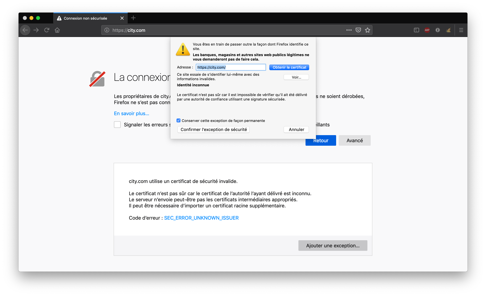
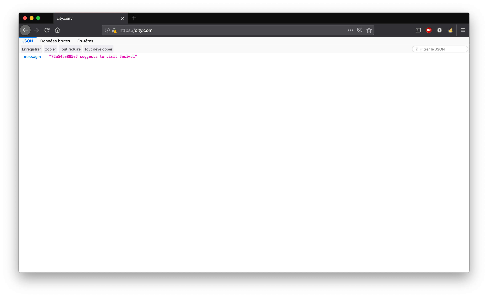

Il est généralement indispensable d'ajouter une terminaison TLS en frontal d'une application web. C'est ce que nous allons effectuer dans cette mise en pratique.

## L'environnement

Nous allons considérer une API HTTP très simple basée sur l'image *lucj/city:1.0*. A chaque requête GET une réponse json est retournée, celle-ci propose de visiter une ville sélectionnée de manière aléatoire. L'API est volontairement très simple, l'intérêt de cette exemple étant la mise en place de la couche de sécurité.

Créez un répertoire et positionnez vous dans celui-ci pour lancer l'ensemble des commandes que nous utiliserons par la suite.

## Exemple de fonctionnement de l'API

Lancez la commande suivante afin d'instancier un container à partir de l'image *lucj/city:1.0*.

```
$ docker run -d -p 8080:80 lucj/city:1.0
```

Vous pouvez alors utiliser l'utilitaire *curl* afin d'envoyer des requêtes GET sur le port 8080 de la machine hôte. Vous obtiendrez alors des réponses similaires à celles obtenues ci-dessous.

```
$ curl localhost:8080
{"message":"a7594b091cb8 suggests to visit Eduvocal"}
$ curl localhost:8080
{"message":"a7594b091cb8 suggests to visit Evemohu"}
```

Dans la suite, nous utiliserons un fichier au format Compose dans lequel nous définirons l'API ainsi qu'un service additionel qui aura le rôle de reverse-proxy, basé sur *nginx* et assurant la terminaison SSL/TLS.

## Authorité de certification (CA)

Nous allons ici créer notre propre autorité de certification, nous utiliserons celle-ci afin de signer le certificat (clé publique + autres informations) utilisé pour authentifier le serveur sur lequel notre application sera déployée.

Note: nous utiliserons le binaire *openssl* pour la gestion de ces clés et certificats

### Création de la clé privée de notre CA

Lancez la commande suivante afin de créer une clé privée pour le CA. Cette clé ne devra pas être divulguée.

```
$ openssl genrsa -out ca-key.pem 2048
```

Note: si nous souhaitons associer une passphrase à cette clé, nous pouvons ajouter l'option *-aes256* à la commande *genrsa* (d'autres options d'encryption peuvent également être utilisées).

### Création du certificat associé

Lancez la commande suivante afin de créer un certificat autosigné pour notre CA.

```
$ openssl req -new -x509 -days 365 -key ca-key.pem -sha256 -subj "/C=FR/L=Nice/O=MyOrg/CN=ca" -out ca.pem
```

---
:fire: si vous obtenez l'erreur suivante lors du lancement de cette commande

```
Can't load /root/.rnd into RNG
140300986950080:error:2406F079:random number generator:RAND_load_file:Cannot open file:../crypto/rand/randfile.c:88:Filename=/root/.rnd
```

il vous faudra éditer le fichier */etc/ssl/openssl.cnf* et commenter la ligne suivante
```
RANDFILE = $ENV::HOME/.rnd
```
---

Maintenant que nous avons créé la paire de clé publique / clé privée de notre CA, nous allons pouvoir les utiliser pour signer le certificat que nous déploierons sur notre serveur. Ce certificat permettra à un client web d'authentifier le serveur avec lequel il communique.

Note: comme nous le verrons par la suite, nous aurons une exception de sécurité dans notre navigateur web car le certificat n'est pas signé par un CA connu. L'utilisation d'un CA du marché (et donc généralement connu par les navigateurs web) permettrait de résoudre ce problème

## Clé privé / publique pour notre domaine

Nous allons supposer que notre application sera exposée sur le nom de domaine *city.com*. Assurez-vous de modifier votre fichier */etc/hosts* de façon à ce que ce domaine soit résolu avec l'adresse IP locale *127.0.0.1*.

### Création de la clé privée

Lancez la commande suivante afin de créer une clé privée pour notre serveur. Cette clé ne devra être connue que du service assurant la terminaison TLS et ne devra pas être divilguée à l'extérieur.

```
$ openssl genrsa -out server-key.pem 2048
```

### Création d'un CSR (Certificate Signin Request)

Lancez la commande suivante afin de créer une demande de signature du certificat du serveur.

```
$ openssl req -new -subj "/C=FR/L=Nice/O=MyOrg/CN=city.com" -key server-key.pem -out server.csr
```

### Signature du certificat

A partir du fichier .csr créé précedemment, lancez la commande suivante afin de créer un certificat signé par notre CA.

```
$ openssl x509 -req -days 365 -in server.csr -CA ca.pem -CAkey ca-key.pem -CAcreateserial -out server-cert.pem
```

Nous avons maintenant l'ensemble de fichier nécessaire pour sécuriser la communication entre un client et notre application:
- server-key.pem
- server-cert.pem

Nous allons voir dans la suite comment les utiliser.

### Configuration Nginx

Afin de configurer notre reverse-proxy et lui donner la fonction de terminaison SSL/TLS, créez un fichier *nginx.conf* avec le contenu suivant:

```
user nginx;
worker_processes 4;
pid /run/nginx.pid;

events {
        worker_connections 768;
}

http {

    include       /etc/nginx/mime.types;
    default_type  application/octet-stream;
    log_format  main  '$remote_addr - $remote_user [$time_local] "$request" '
                      '$status $body_bytes_sent "$http_referer" '
                      '"$http_user_agent" "$http_x_forwarded_for"';

    upstream api {
        server api;
    }

    server {
        listen                    80;
        server_name               city.com;
        rewrite ^ https://city.com$request_uri? permanent;
    }

    server {
        listen                    443 ssl;
        server_name               city.com;
        ssl_certificate           /etc/ssl/certs/server.crt;
        ssl_certificate_key       /etc/ssl/certs/server.key;
        ssl_protocols             TLSv1 TLSv1.1 TLSv1.2;
        ssl_prefer_server_ciphers on;
        ssl_ciphers               ECDH+AESGCM:ECDH+AES256:ECDH+AES128:DH+3DES:!ADH:!AECDH:!MD5;
        ssl_session_cache         shared:SSL:20m;
        ssl_session_timeout       4h;

        location / {
            proxy_set_header Host $host;
            proxy_set_header X-Real-IP $remote_addr;
            proxy_set_header X-Forwarded-Proto $scheme;
            proxy_set_header X-Forwarded-For $proxy_add_x_forwarded_for;
            proxy_pass   http://api;
        }
    }
}
```

Ce fichier défini:
- un serveur virtuel écoutant en http
- une redirection automatique sur https
- la clé privée et le certificat du serveur pour la communication https
- le dispatch des requêtes sur le service *api* (celui basé sur l'image *lucj/city:1.0*)

Note: cette configuration n'est pas optimale, le choix des protocoles, des ciphers et autres options de sécurité est en dehors du scope de cette mise en pratique

## Les bénéfices de Swarm mode en développement

Avant de déployer notre application, il est important de nous assurer que l'hôte Docker que nous allons utiliser est en mode "Swarm", cela se fait facilement avec la commande suivante:

```
$ docker swarm init
```

Un daemon Docker en mode Swarm apporte de nombreuses features par défaut. Parmi celles-ci, la gestion des configurations et des secrets:
- Config est une primitive Docker qui permet de fournir une configuration à runtime
- Secret est une primitive Docker qui permet de gérer les informations confidentielles (login/mot de passe, clé ssh, ...), de les chiffrer au repos et en transit, et de les rendre disponibles seulement aux éléments qui en ont besoin

Parmi les éléments que nous avons crées ci-dessus, nous allons devoir fournir les fichiers *server-key.pem*, *server-cert.pem* et *nginf.conf* au nouveau service *proxy*.

En tenant compte du type de la donnée considérée (publique ou confidentielle) nous utiliserons un objet *Config* ou bien un object *Secret* pour la manipuler.

### Définition dans un fichier Compose

Créez le fichier _docker-stack.yml_ avec le contenu suivant. Ce fichier défini l'application que nous allons déployer: *reverse-proxy* + *api*.

```
version: '3.3'
services:
  proxy:
    image: nginx:1.16
    configs:
      - source: server_config
        target: /etc/nginx/nginx.conf
      - source: server_cert
        target: /etc/ssl/certs/server.crt
    secrets:
      - source: server_key
        target: /etc/ssl/certs/server.key
    ports:
      - "80:80"
      - "443:443"
    deploy:
      restart_policy:
        condition: on-failure
  api:
    image: lucj/city:1.0
    deploy:
      restart_policy:
        condition: on-failure
configs:
  server_config:
    file: ./nginx.conf
  server_cert:
    file: ./server-cert.pem
secrets:
  server_key:
    file: ./server-key.pem
```

Ce fichier définit:
- une application composée de 2 services (*proxy* et *api*)
- deux configurations, la première basée sur le fichier _nginx.conf_, la seconde sur le fichier _server_cert.pem_
- un secret basé sur le contenu du fichier _server-key.pem_

Les Config et le Secret sont montés dans le système de fichiers du container du service *proxy*

## Test

Nous pouvons alors lancer l'application avec la commande suivante:

```
$ docker stack deploy -c docker-stack.yml app
```

Après quelques secondes, les services sont disponibles:

```
$ docker service ls
ID            NAME       MODE        REPLICAS  IMAGE          PORTS
34i48r08zjdn  app_api    replicated  1/1       lucj/city:1.0
jngcz7xtwumi  app_proxy  replicated  1/1       nginx:1.16     *:80->80/tcp,*:443->443/tcp
```

Nous pouvons maintenant ouvrir un navigateur web, aller sur *http://city.com* et constater un message d'erreur qui nous informe que la connexion n'est pas sécurisée. Cela vient du fait que le CA que nous avons utilisé pour signer le certificat du serveur n'est pas connu par le navigateur.

Il faudra confirmer une exception de sécurité pour pouvoir passer cette étape.



Le site sera ensuite accessible en https



## Résumé

Nous avons donc rapidement pu ajouter un service assurant la terminaison TLS à notre application.

Un des points intéressants est la façon dont nous avons fournis la configuration, le certificat et la clé privée au reverse-proxy en utilisant les primitives Config et Secret.

Si nous avions fait signer le certificat du serveur par une authorité de certification connue (Verisign, Symantec, digicert, ...), nous n'aurions pas eu le problème de connexion non sécurisée.
