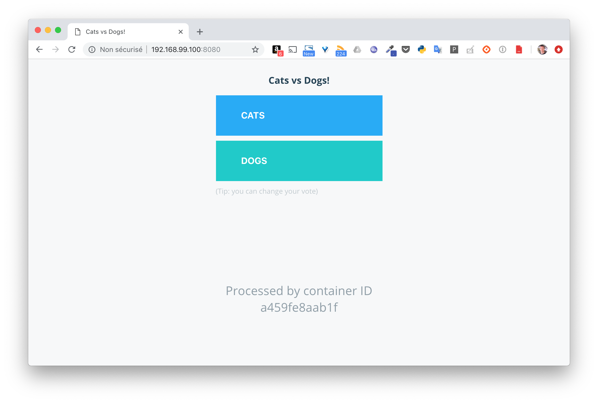
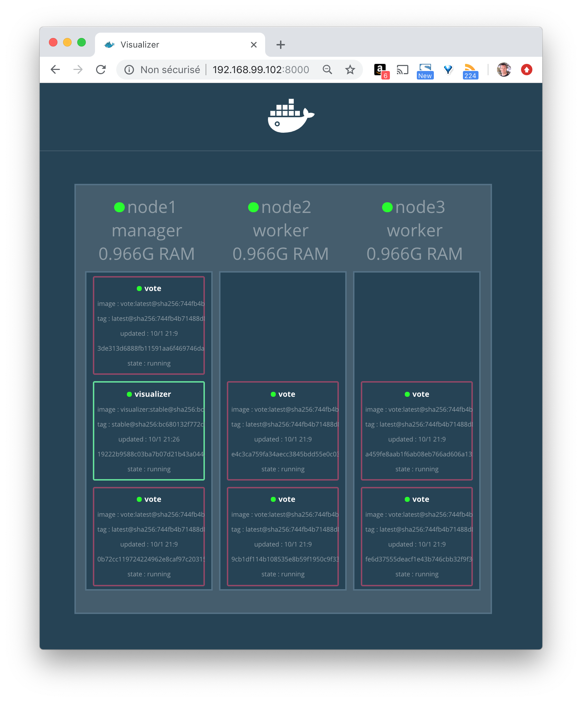
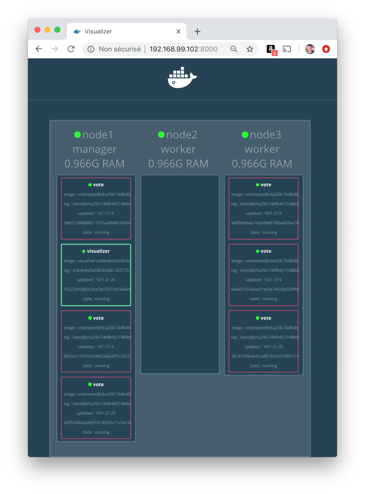

# Création d'un service

Dans cette partie, nous allons créer un service simple, le déployer et le scaler (c'est à dire modifier le nombre de containers instanciés pour celui-ci). Nous changerons également la disponibilité d’un node pour voir l’impact sur les tâches en cours.

## Pré-requis

Vous pouvez utiliser un Swarm que vous avez créé lors des exercices précédent, ou bien en créer un nouveau. N'hésitez pas à vous reporter aux cours ou bien aux exercices précédents si vous avez besoin de revoir le process de création.

## Création d’un service

Utilisez la commande suivante pour créer le service nommé *vote* ayant les spécifications ci-dessous:
- basé sur l’image *instavote/vote:latest*
- publication du 80 sur le port 8080 des nodes du Swarm
- 6 réplicas

> Le nombre de réplicas correspond au nombre de tâches qui seront instanciées pour ce service. Chaque tâche lancera un container basée sur l’image définie dans le service.

Lancez cette commande dpuis un node qui a le status de manager.

```
$ docker service create \
    --name vote \
    --publish 8080:80 \
    --replicas 6 \
    instavote/vote
```

Après quelques secondes, le temps que l’image *instavote/vote:latest* soit téléchargée sur chaque node, les 6 tâches du services sont lancées.

```
iloiyvba6uensc6bzvhvbxv93
overall progress: 6 out of 6 tasks
1/6: running   [==================================================>]
2/6: running   [==================================================>]
3/6: running   [==================================================>]
4/6: running   [==================================================>]
5/6: running   [==================================================>]
6/6: running   [==================================================>]
verify: Service converged
```

Utilisez la commande suivante pour lister les tâches du service *vote*.

```
$ docker service ps vote
```

Vous devriez obtenir un résultat proche du résultat suivant (aux identifiants près), indiquant qu'il y a 2 tâches par node.

```
ID            NAME    IMAGE                   NODE   DESIRED STATE  CURRENT STATE           ERROR PORTS
xnon20jonsfd  vote.1  instavote/vote:latest   node2  Running        Running 13 minutes ago
rganh2g8y8b7  vote.2  instavote/vote:latest   node3  Running        Running 13 minutes ago             
on8oog1833yq  vote.3  instavote/vote:latest   node1  Running        Running 13 minutes ago             
hmp2wtvojxro  vote.4  instavote/vote:latest   node2  Running        Running 13 minutes ago             
vdizjy291q4t  vote.5  instavote/vote:latest   node3  Running        Running 13 minutes ago             
mjpn0ybsg6pj  vote.6  instavote/vote:latest   node1  Running        Running 13 minutes ago
```

> Le service publie le port 80 sur le port 8080 du swarm via le mécanisme de routing mesh. Cela signifie que le service sera accessible depuis le port 8080 de chaque node du cluster. Nous pouvons vérifier le routing mesh en envoyant une requête sur le port 8080 de node1, node2 ou node3. Quelque soit le node sur lequel la requête est envoyée, nous aurons accès à l'interface de l'application. Nous reviendrons en détails sur le routing mesh un peu plus tard dans le cours.



Note: Seule la partie front-end est disponible sur cet exemple, il n’y a pas le backend permettant de prendre en compte la sélection.

Les requêtes envoyées sur le port 8080 d’un node du Swarm sont traitées selon un algorithme de round-robin entre les différents containers intanciés pour le service. Cela signifie que chacun des containers recevra une requète à tour de rôle.

Nous pouvons l’observer en lançant plusieurs requêtes à la suite et observer l’identifiant ID du container depuis l’interface web

## Ajout du service de visualisation

Utilisez la commande suivante pour lancer un service qui servira à la visualisation des containers sur le cluster.

```
$ docker service create \
  --name visualizer \
  --mount type=bind,source=/var/run/docker.sock,destination=/var/run/docker.sock \
  --constraint 'node.role == manager' \
  --publish "8000:8080" dockersamples/visualizer:stable
```

Ce service a la spécification suivante:
- il est nommé *visualizer*
- il fait un bind-mount de la socket */var/run/docker.sock/* afin de permettre au container du visualizer de dialoguer avec le daemon Docker sur lequel il tourne
- il utilise une contrainte de déploiement pour que le replica du service tourne sur le node qui a le rôle manager
- il publie le port *8080* sur le port *8000* sur chaque hôte du Swarm

Nous pouvons alors voir la répartition des containers sur les nodes via l’interface du visualiseur. Cette interface donne le même résultat que lorsque l’on liste les service en ligne de commande, mais c’est une façon assez ludique de visualiser les containers.



Note: le visualizer tourne sur le node master mais il est possible d'y accéder depuis n'importe quel node du Swarm grace au mécanisme de routing mesh

## Passage du node2 en drain

Un node est dans l’un des états suivants:
- active, il peut recevoir des nouvelles tâches
- pause, il ne peut pas recevoir de nouvelles tâches mais les tâches en cours restent inchangées
- drain, il ne peut plus recevoir de nouvelles tâches et les tâches en cours sont re-schédulées sur d’autres nodes

Avec la commande suivante, changez l’availability du *node2* en lui donnant la valeur *drain*.

```
$ docker node update --availability drain node2    
```

Depuis le visualizer, regardez comment la répartition des tâches précédentes a été modifiée.



Nous pouvons voir qu’il n’y a plus de tâche sur le node2. Elles ont été stoppées et reschédulées sur les autres nodes.

La commande suivante change l’availability du node2 en le repositionnant dans l’état active. Les tâches existantes sur node1 et node3 restent inchangées mais de nouvelles tâches pourront de nouveau être schédulées sur node2.

```
$ docker node update --availability active node2
```

## En résumé

Nous avons vu dans cette mise en pratique comment créer des services très simples. Nous avons également vu l'influence de la propriété *availability* d'un node par rapport à la répartition des tâches des services.
