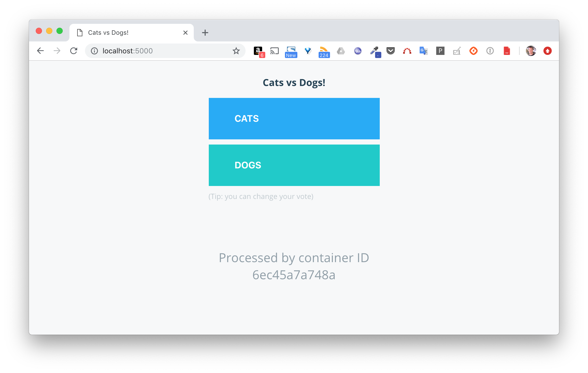
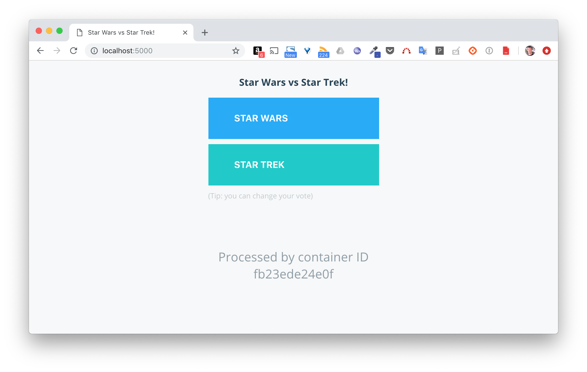
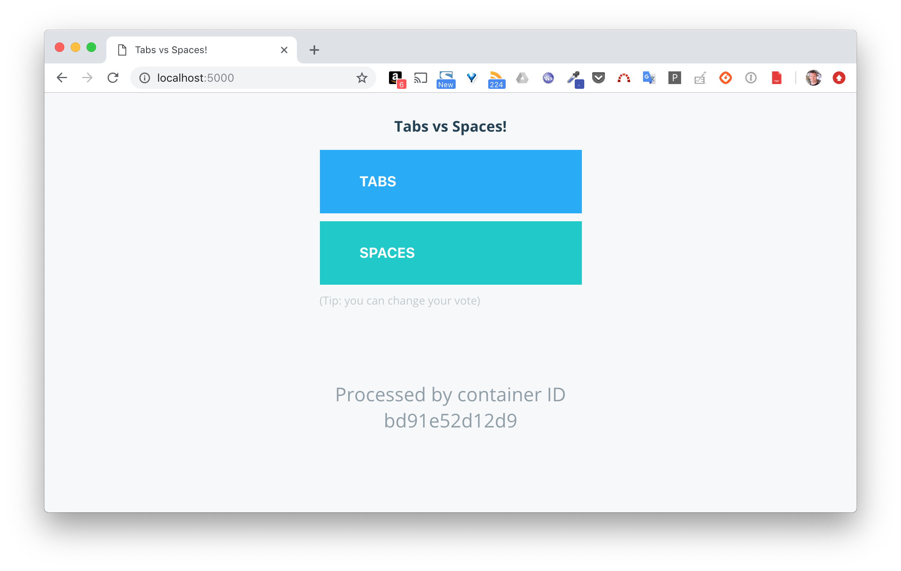

# Mise à jour et rollback d'un service

Grace à quelques options, nous allons voir qu'il est très simple de configurer la mise à jour et le rollback d'un service déployé sur un Swarm.

## Mise en place d'un Swarm

Vous pouvez utiliser un Swarm que vous avez créé lors des exercices précédent, ou bien en créer un nouveau. N'hésitez pas à vous reporter aux cours ou bien aux exercices précédents si vous avez besoin de revoir le process de création.
Cet exercice sera illustré avec un Swarm local constitué d'un seul node.

## Déploiement d'un service

Utilisez la commande suivante pour déployer un service basé sur l'image *instavote/vote*.

```
$ docker service create \
--name vote \
--replicas 4 \
--publish 5000:80 \
instavote/vote
```

4 replicas sont définis pour ce service, cela signifie que 4 tâches (une tâche correspondant à un container) tournent maintenant sur le Swarm. Si une requête arrive sur le port 5000 d'un node du Swarm, elle sera load balancé sur l'une de ces 4 tâches.

Les copies d'écran ci-dessous illustrent l'envoi de 2 requêtes successives. Chacune d'entre elles est traitée par un container différent.

Note: les requêtes sont envoyées sur *localhost* car dans cette exemple le cluster Swarm a été mis en place sur la machine locale.




Note: ce service fournit simplement l'interface de vote de la Voting App. Elle ne permet pas d'effectuer un vote car le backend n'est pas déployé. Cette configuration est suffisante pour illustrer la mise à jour et de rollback, comme on va le voir ci-dessous.

## Mise à jour du service

La commande ```docker service update``` permet de mettre à jour un service les différents paramètres d'un service.

Le format de mise à jour est similaire (--XXX-add / ---XXX-rm) pour un grand nombre de paramètres:

- --constraint-add / --constraint-rm : mise à jour des contraintes de placement
- --container-label-add / --container-label-rm : ajout / suppression de labels au niveau des containers d'un service
- --label-add / --label-rm : ajout / suppression de labels au niveau d'un service
- --env-add / --env-rm : ajout / suppression de variables d'environnement
- --mount-add / --mount-rm : ajout / suppression de points de montage
- --network-add / --network-rm : attache / détache un service d'un réseau
- --publish-add / --publish-rm : publication / dé-publication d'un port à l'extérieur
- --secret-add / --secret-rm : donne / supprime l'accès à un secret

Nous reviendrons sur certaines de ces options dans la suite du cours. Un autre élément souvent mis à jour est l'image sur lequel est basé un service, on utilisera pour cela la commande

```
docker service update --image IMAGE:VERSION nom_du_service
```

La commande suivante liste les différents éléments pouvant être mis à jour.

```
docker service update --help
```

L'approche rolling update permet de mettre à jour les tâches de façon séquentielle. Lancez la commande suivante pour mettre à jour le service vote afin qu'il utilise maintenant l'image *instavote/vote:indent* et non plus l'image *instavote/vote*.

```
$ docker service update --image instavote/vote:indent vote
```

Comme vous pouvez le voir pendant cette mise à jour, les tâches sont mises à jour l'une après l'autre.

```
vote
overall progress: 1 out of 4 tasks
1/4: running   [==================================================>]
2/4: ready     [======================================>            ]
3/4:
4/4:
```

Pendant ce processus, chaque tâche passe par différents états:
- preparing
- ready
- starting
- running

Une tâche est mise à jour dès que la mise à jour de la tâche précédente est terminée. C'est le comportement par défaut. On peut donc maintenant voter entre Tabs et Space.


En utilisant les options de configuration suivantes, nous pouvons customiser la façon dont le rolling update est effectué:
- --update-parallelism définit le nombre de tâches à mettre à jour en même temps
- --update-delay définit un temps d'attente entre la mise à jour de 2 groupes successifs de tâches

Mettez à jour le service avec la commande suivante. Celle-ci spécifie que lors de la prochaine mise à jour de l'image (ou de tout autre paramètre nécessitant un redémarrage du service) les tâches seront mises à jour 2 par 2 et qu'un temps de 10 secondes sera respecté entre la mise à jour de chaque groupe de tâches.

```
$ docker service update \
--update-parallelism 2 \
--update-delay 10s \
vote
```

Nous pouvons voir que les tâches ne sont pas stoppées lors de cette mise à jour, elles restent dans l'état *running*, il n'y a pas besoin de redémarrage lors de la mise à jour de ces 2 paramêtres.

Si nous mettons maintenant à jour l'image du service, le rolling upate se comportera différemment. C'est ce que nous allons vérifier.

Avec la commande suivante, changez l'image du service par *instavote/vote:movies*.

```
$ docker service update --image instavote/vote:movies vote
```

Comme vous pouvez le constater, 2 tâches ont été mises à jour, suivies 10 secondes plus tard par les 2 autres tâches.

```
vote
overall progress: 2 out of 4 tasks
1/4: running   [==================================================>]
2/4: running   [==================================================>]
3/4:
4/4:
```

L'interface du service propose maintenant de voter entre Star Wars et Star Trek.



## Inspection du service

Si nous inspectons le service, nous pouvons voir l'existence des clés *Spec* et *PreviousSpec*.

```
$ docker service inspect vote
[
  {
    "ID": "osztlllvdwswkzyrjojcykakf",
    "Version": {
      "Index": 67004
    },
    "Spec": {
      "Name": "vote",
      "TaskTemplate": {
        "ContainerSpec": {
          "Image": "instavote/vote:movies@sha256:b50..d8c",
          …
        },
        …
    },
    "PreviousSpec": {
      "Name": "vote",
      "TaskTemplate": {
        "ContainerSpec": {
          "Image": "instavote/vote:indent@sha256:265...c35",
          …
        },
        …
    }
  }
]
```

Alors que la clé *Spec* fait référence à la spécification actuelle du service (celle correspondant à l'image avec le tag *movies*), la clé *PreviousSpec* fait référence à la spécification correspondant au tag *indent*. On voit donc ici que Swarm garde 2 niveaux d'historique.

## Rollback

Comme la spécification précédente du service est conservée, il est possible de revenir à cette spécification (faire un rollback).

Lancez la commande suivante afin de revenir à la version du service ayant l'image *instavote/vote:indent*.

```
$ docker service rollback vote
```

Comme vous pouvez le constater, les tâches sont "rollbackées" les unes après les autres.
Nous n'avons pas précisé la configuration spécifiant comment le rollback doit être fait, c'est donc le comportement par défaut qui est appliqué.

```
overall progress: rolling back update: 1 out of 4 tasks
1/4: running   [>                                                  ]
2/4: starting  [=====>                                             ]
3/4:
4/4:
```

Comme nous l'avons fait pour la configuration du rolling update, nous aurions pu spécifier les options suivantes pour configurer la façon dont le rollback doit être effectué:
- --rollback-parallelism: définit le nombre de tâches à "rollbacker" en même temps
- --rollback-delay: définit un temps d'attente entre le rollback de 2 groupes successifs de tâches

A la suite du rollback, l'image *instavote/vote:indent* est de nouveau utilisée par le service. Vérifiez le depuis l'interface web.



## Rollback automatique

Dans l'exemple précédent, nous avons effectué un rollback de façon manuelle. Nous allons maintenant voir un exemple dans lequel le rollback est effectué de manière automatique.

Les images *lucj/whoami:1.0* et *lucj/whoami:2.0* sont 2 versions d'une api simple. Celle-ci expose le endpoint */whoami* et, pour chaque requête reçue, elle retourne le nom du container qui l'a traitée.

Le code de l'api est défini dans le fichier *index.js*:

```
const express    = require('express'),
      http       = require('http'),
      os         = require('os'),
      port       = 8000;
var app = express();

// Define endpoint
app.get("/whoami", function(req, res, next) {
  return res.send(os.hostname());
});

// Create HTTP server
var server = http.createServer(app);

// Start server
server.listen(port);
server.on('listening', () => {
  console.log("listening on port " + port);
})
```

Les dépendances sont définies dans le fichier *package.json*:

```
{
  "name": "www",
  "version": "0.0.1",
  "private": true,
  "scripts": {
    "start": "node index.js",
    "test": "exit 0"
  },
  "dependencies": {
    "express": "~4.14.1",
    "winston": "^2.3.1"
  }
}
```

Le Dockerfile utilisé pour la construction de ces images est le suivant:

```
FROM node:10.15-alpine

RUN apk update && apk add curl

HEALTHCHECK --interval=5s --timeout=3s --retries=3 \
CMD curl -f http://localhost:8000/whoami || exit 1

COPY package.json /app/package.json
WORKDIR /app
RUN npm install
COPY . /app

CMD ["npm", "start"]
```

La chose importante à noter ici est la présence de l'instruction *HEALTHCHECK*. Elle est utilisée pour vérifier que le service fonctionne correctement. A l'intérieur du container, toutes les 5 secondes, un process vérifie si le endpoint */whoami* répond. Swarm utilise le résultat de ce healthcheck savoir si un tâche est en bonne santé ou non.

L'image avec le tag *1.0* fonctionne correctement. L'image avec le tag *2.0* contient un  a été créée à partir d'une version légèrement modifiée du code dans laquelle un bug a été introduit afin que le healthcheck retourne un code d'erreur (instruction exit 1 spécifié dans le Dockerfile)

Utilisez la commande suivante pour créer un service qui utilise l'image *lucj/whoami:1.0*.

```
$ docker service create --name whoami \
--replicas 2 \
--update-failure-action rollback \
--update-delay 10s \
--update-monitor 10s \
--publish 8000:8000 \
lucj/whoami:1.0
```

Différentes options sont spécifiées ici:
- --update-failure-action définit l'action à effectuer si une mise à jour se déroule mal (c'est à cet endroit que l'on précise le rollback automatique)
- --update-delay définit le temps à attendre entre la mise à jour de 2 tâches successives
- --update-monitor définit le temps à attendre après la mise à jour d'une tâche pour vérifier son état de santé

Note: on ne précise pas ici le nombre de tâches à mettre à jour en parallèle, par défaut elles seront donc mises à jour une à une


Une fois que le service est créé, vérifier qu'il fonctionne correctement en envoyant plusieurs requêtes à la suite. Dans la commande suivante, remplacez *IP* par l'adresse IP d'une des machines de votre Swarm, ou par localhost si vous êtes connecté en ssh sur l'une d'entre elles.

```
$ curl http://IP:8000/whoami
6fb7de6faae1                                                                             $ curl http://IP:8000/whoami
86035acd13fa                                                                             $ curl http://IP:8000/whoami
6fb7de6faae1%                                                                            $ curl http://IP:8000/whoami
86035acd13fa
```

Vous devriez observer que chaque container est utilisé à tour de rôle pour traiter les requêtes successives.

Avec la commande suivante, mettez le service à jour de façon à ce qu'il utilise l'image *lucj/whoami:2.0*

```
$ docker service update --image lucj/whoami:2.0 whoami
```

Au bout de quelques secondes, vous devriez observer un rollback automatique déclenché par l'echec de mise à jour de la première tâches. Ceci est dû à l'instruction HEALTHCHECK qui renvoie une erreur dans le cas de l'image *lucj/whoami:2.0*.


```
whoami
overall progress: 0 out of 2 tasks
1/2: starting  [============================================>      ]
2/2:
service rolled back: rollback completed
```

Durant cette tentative de mise à jour, la seconde tâche n'a pas été impactée et le service était donc toujours disponible, la première tâche n'étant plus utilisée lors du load balancing. Le service aurait été indisponible si nous n'avions spécifié qu'un seul réplica.

## En résumé

Dans cet exercice, nous avons vu comment configurer un rolling update et également comment effectuer un rollback. Il est important de spécifier les paramêtres de mise à jour d'un service afin de minimiser l'indisponibilité de l'application.
