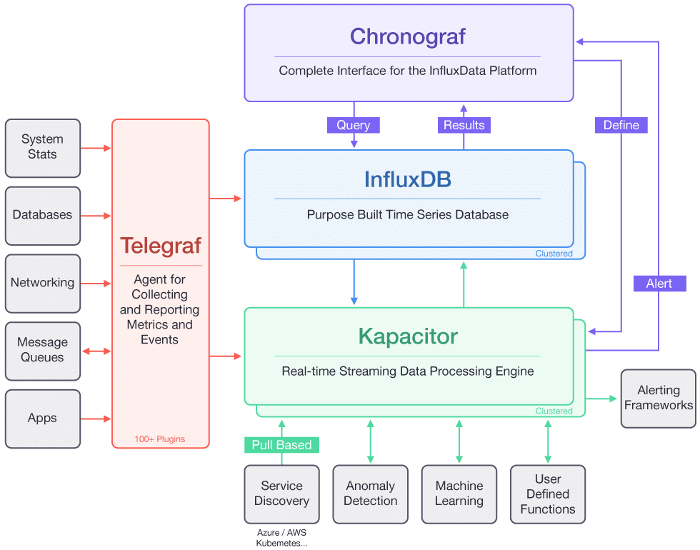
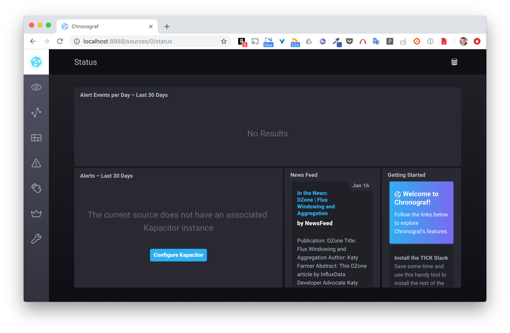
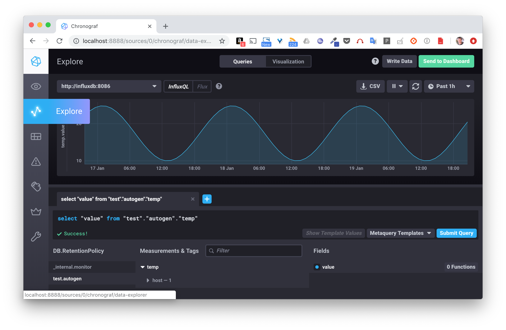

# Déployment de la stack TICK sur un Swarm

## Mise en place d'un Swarm

Vous pouvez utiliser un Swarm que vous avez créé lors des exercices précédent, ou bien en créer un nouveau. N'hésitez pas à vous reporter aux cours ou bien aux exercices précédents si vous avez besoin de revoir le processus de création.
Cet exercice sera illustré avec un Swarm local constitué d'un seul node.

## TICK stack

La stack *TICK* est principalement dédiée à la gestion des séries temporelles. Elle constitue un choix intéressant en tant que backend de réception et de stockage de données provenant de capteurs IoT (par exemple: température, pression atmosphérique, niveau d'eau, ...).

Le nom de cette stack provient des éléments dont elle est composée:
- Telegraf
- InfluxDB
- Chronograf
- Kapacitor

Le schéma ci-dessous illustre l'architecture globale et détaille de rôle de chaque composant.



Des données sont envoyées à *Telegraf*, elles sont ensuite sauvegardées dans la base de données *InfluxDB*. *Chronograp* expose une interface web permettant alors d'analyser ces données. *Kapacitor* peut effectuer des traitements, du monitoring et également déclencher des alertes.

## Spécification de la stack

La stack *TICK* peut facilement être spécifiée dans un fichier au format Docker Compose.

Créez le fichier *tick.yml* contenant la spécification suivante définissant les 4 composants de la stack.

```
version: "3.6"
services:
  telegraf:
    image: telegraf:1.18-alpine
    configs:
    - source: telegraf-conf
      target: /etc/telegraf/telegraf.conf
    ports:
    - 8186:8186
  influxdb:
    image: influxdb:1.8-alpine
  chronograf:
    image: chronograf:1.8-alpine
    ports:
    - 8888:8888
    command: ["chronograf", "--influxdb-url=http://influxdb:8086"]
  kapacitor:
    image: kapacitor:1.5-alpine
    environment:
    - KAPACITOR_INFLUXDB_0_URLS_0=http://influxdb:8086
configs:
  telegraf-conf:
    file: ./telegraf.conf
```

Plusieurs choses à noter ici:
- la configuration du service *telegraf* est fournie via un objet *Config*
- la commande de lancement du service *chronograf* spécifie l'URL du service *influxdb* auquel il doit se connecter
- une variable d'environnement est utilisée dans la définition du service *kapacitor* afin de spécifier l'URL du service *influxdb* auquel il doit se connecter

Créez le fichier *telegraf.conf* avec le contenu suivant:

```
[agent]
  interval = "5s"
  round_interval = true
  metric_batch_size = 1000
  metric_buffer_limit = 10000
  collection_jitter = "0s"
  flush_interval = "5s"
  flush_jitter = "0s"
  precision = ""
  debug = false
  quiet = false
  logfile = ""
  hostname = "$HOSTNAME"
  omit_hostname = false
[[outputs.influxdb]]
  urls = ["http://influxdb:8086"]
  database = "test"
  username = ""
  password = ""
  retention_policy = ""
  write_consistency = "any"
  timeout = "5s"
[[inputs.http_listener]]
  service_address = ":8186"
```

En quelques mots, ce fichier de configuration:
- définit un endpoint http qui pourra être utilisé pour recevoir des données
- spécifie que les données reçues seront sauvegardées dans une base de données nommée *test*

## Déploiement de l'application

Utilisez la commande suivante pour déployer l'application spécifiée dans le fichier *tick.yml*

```
$ docker stack deploy -c tick.yml tick
```

Vous obtiendrez le résultat suivant:

```
Creating network tick_default
Creating config tick_telegraf-conf
Creating service tick_chronograf
Creating service tick_kapacitor
Creating service tick_telegraf
Creating service tick_influxdb
```

Vérifiez ensuite que la stack a été déploiée correctement.

```
$ docker stack ls
NAME            SERVICES        ORCHESTRATOR
tick            4               Swarm
```

Listez les services de la stack *tick* et vérifiez que ceux-ci sont opérationnels.

```
$ docker stack services tick
ID             NAME              MODE          REPLICAS   IMAGE               PORTS
54vsxsibbj4o   tick_kapacitor    replicated    1/1        kapacitor:latest
5a2o85ehsspg   tick_influxdb     replicated    1/1        influxdb:latest
rro8id1t6shw   tick_telegraf     replicated    1/1        telegraf:latest     *:8186->8186/tcp
uk9ejkbaaukm   tick_chronograf   replicated    1/1        chronograf:latest   *:8888->8888/tcp
```

L'interface du service *chronograf* est alors disponible sur le port *8888* de n'importe quel node du cluster.



## Tests

Afin de tester l'application, nous allons envoyer des données sur le port *8186* (port publié par le service *telegraf*) et vérifier le résultat depuis l'interface de *chronograf*.

Nous allons utiliser l'image *lucj/genx*, qui package une application écrite en Go permettant de générer des données suivant des distributions linéaire ou sinusoïdale.

Ce binaire propose différentes options que l'on peut voir ci-dessous.

```
$ docker run lucj/genx
Usage of /genx:
 -duration string
      duration of the generation (default “1d”)
 -first float
      first value for linear type
 -last float
      last value for linear type (default 1)
 -max float
       max value for cos type (default 25)
 -min float
       min value for cos type (default 10)
 -period string
       period for cos type (default “1d”)
 -step string
       step / sampling period (default “1h”)
 -type string
       type of curve (default “cos”)
```

Nous allons simuler ici des données de température avec les caractéristiques suivantes:
- distribution sinusoïdale
- 3 jours de données avec une période de 1 jour
- valeurs comprises entre 10 et 25
- échantillonage toutes les heures

Note: ce n'est évidemment pas une distribution réelle mais elle sera suffisante pour les tests qui vont suivre

Lancer la commande suivante, celle-ci va générer des données et les sauvegarder dans le fichier */tmp/data*.

```
$ docker run lucj/genx:0.1 -type cos -duration 3d -min 10 -max 25 -step 1h > /tmp/data
```

Les données générées correspondent à une liste de [timestamp, température], par exemple:

```
$ cat /tmp/data
1547671058 22.26
1547674658 23.60
1547678258 24.52
1547681858 24.96
1547685458 24.90
1547689058 24.33
1547692658 23.29
1547696258 21.87
...
```


Nous allons à présent utiliser un script bash pour envoyer ces données au service *telegraf*. Créez le fichier *send.sh* avec le contenu suivant (remplacez *IP* par l'adresse IP de l'une des machine de votre Swarm):

```
endpoint="http://<IP>:8186/write"
cat /tmp/data | while read line; do
  ts="$(echo $line | cut -d' ' -f1)000000000"
  value=$(echo $line | cut -d' ' -f2)
  curl -i -XPOST $endpoint --data-binary "temp value=${value} ${ts}"
done
```

Lancez le script:

```
$ chmod +x ./send.sh
$ ./send.sh
```

Depuis le menu *Explore* sur la gauche de l'interface de *chronograf*, entrez la query ```select "value" from "test"."autogen"."temp"``` et vérifiez que les données ont été correctement reçues et persistées dans *InfluxDB*.



## En résumé

En quelques lignes de commandes nous avons déployé une application relativement complexe, la stack TICK, en tant qu'objet *Stack* sur un Swarm. Nous avons ensuite envoyé des données sur le point d'entrée de cette stack et vérifié que celles-ci ont correctement été persistées.
