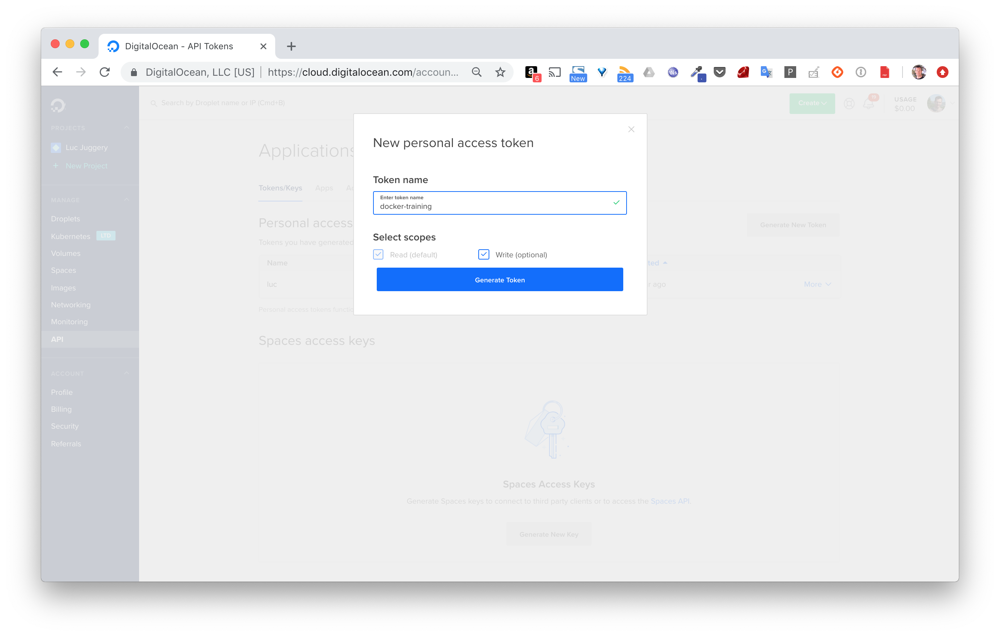
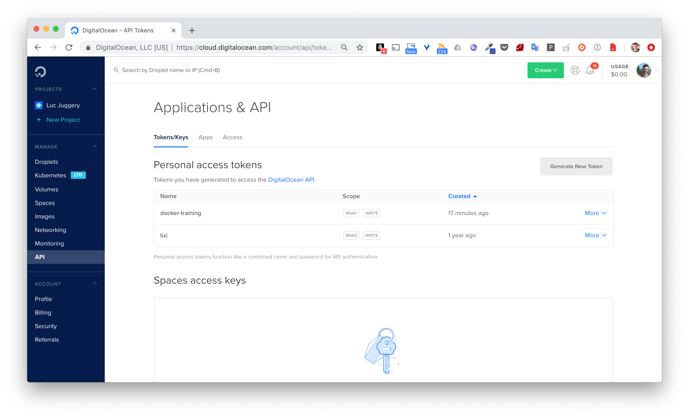
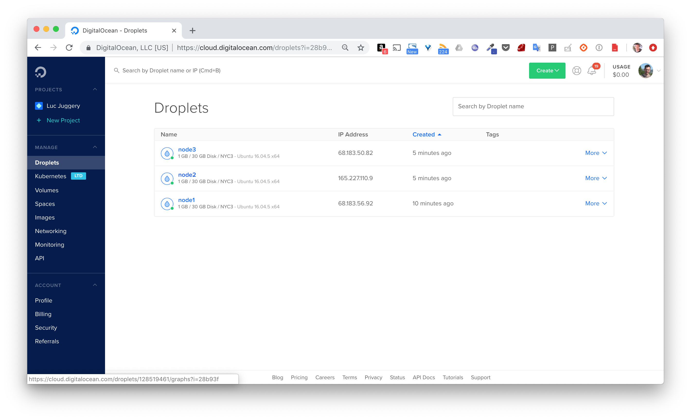

Dans cette mise en pratique, nous allons créer un cluster Swarm sur le cloud provider [DigitalOcean](https://digitalocean.com).

> Attention, dans cette mise en pratique, nous allons créer un cluster swarm sur DigitalOcean, un cloud provider très connu et simple à utiliser. Cependant, comme pour l'ensemble des cloud providers (Google Compute Engine, Amazon AWS, Packet, Rackspace, ...) l'instantiation de VMs est payante (très peu cher pour un test de quelques minutes cependant) et nécessite d'avoir un compte utilisateur. Si vous ne souhaitez pas réaliser la manipulation, n'hésitez pas à lire cet exemple sans l'appliquer.

## 1. Creation d'un compte sur DigitalOcean

Rendez-vous sur [DigitalOcean](https://digitalocean.com) et cliquez sur Signup en haut à droite.


## 2. Provisionnez votre compte

Une fois votre compte créé, il vous faudra le provisionner, seulement quelques euros suffiront à pouvoir jouer avec un cluster swarm.

## 3. Créez 3 machines virtuelles

Vous avez différentes options pour cela:

- depuis le menu *API*, vous pouvez créer un token que vous utiliserez plus tard avec Docker Machine.





- vous pouvez créer les VMs depuis l'interface web de DigitalOcean et ensuite installer Docker sur chaque machine (manuellement ou avec un outils de configuration management comme Ansible)

Nous utiliserons la première méthode car elle est beaucoup plus simple et pratique.

Sauvegardez le token généré dans la variable d'environnement TOKEN et lancez les commandes suivantes pour créer les 3 machines: *node1*, *node2* et *node3*.

```
$ docker-machine create --driver digitalocean --digitalocean-access-token $TOKEN --digitalocean-size=1gb node1
$ docker-machine create --driver digitalocean --digitalocean-access-token $TOKEN --digitalocean-size=1gb node2
$ docker-machine create --driver digitalocean --digitalocean-access-token $TOKEN --digitalocean-size=1gb node3
```

> Nous spécifions une taille de 1gb via l'option --digitalocean-size afin d'avoir des VMs plus "petites" (et 2 fois moins chères) que celles par défaut. Par défaut, une distribution Ubuntu 16.04 sera installée sur chaque machine virtuelle.

Une fois les 3 machines créées, assurez vous qu'elles sont bien listées par Docker Machine.

```
$ docker-machine ls
NAME    ACTIVE DRIVER         STATE     URL                       SWARM  DOCKER   ERRORS
node1   -      digitalocean   Running   tcp://68.183.56.92:2376          v18.09.1
node2   -      digitalocean   Running   tcp://165.227.110.9:2376         v18.09.1
node3   -      digitalocean   Running   tcp://68.183.50.82:2376          v18.09.1
```

Les machines que nous venons de créer sont aussi visibles depuis l'interface web de DigitalOcean



## 4. Initialisez le swarm sur le node1

Utilisez la commande suivante afin de lancer un shell ssh sur le node1

```
$ docker-machine ssh node1
```

Initialisez ensuite alors le swarm

```
root@node1:~# docker swarm init
```

Vous obtiendrez un message d'erreur similaire à celui ci-dessous:

```
Error response from daemon: could not choose an IP address to advertise since this system has multiple addresses on interface eth0 (68.183.56.92 and 10.17.0.5) - specify one with --advertise-addr
```

Etant donné que la VM a plusiurs adresse IP privée, il faut spécifier celle que devront utiliser les autres machines du Swarm pour communiquer avec *node1*. Comme node1, node2 et node3 ne sont pas sur un réseau privé, chacune sera accessible via son IP publique.

Relancez l'initialisation du swarm en spécifiant l'adresse publique (celle qui n'est pas en 10.x.x.x) avec l'option *--advertise-addr* (nous appelerons cette adresse ADRESSE_IP_NODE1 dans la suite).

```
root@node1:~# docker swarm init --advertise-addr ADRESSE_IP_NODE1
```

Vous obtiendrez un résultat proche de celui ci-dessous:

```
Swarm initialized: current node (0dfpxa09fny4qvbimx1googa4) is now a manager.

To add a worker to this swarm, run the following command:

    docker swarm join --token SWMTKN-1-5gq3vzwpqig6r5o1zf1czlh1js7uwp1qgct4jtagi6ucw6zh1t-3pdk4qvwhgy8xdufofbco76t2 165.227.115.157:2377

To add a manager to this swarm, run 'docker swarm join-token manager' and follow the instructions.
```

Cette fois-ci le swarm est bien initialisé, et nous obtenons la commande à lancer depuis d'autres machines afin de les ajouter en tant que worker. Le token que vous obtiendrez sera différent de celui ci-dessus, nous appelerons celui-ci TOKEN_WORKER dans la suite.

> Afin ajouter d'autres manager, il est nécessaire de récupérer le token dédié à l'ajout de manager avec la commande ```docker swarm join-token manager```

Listez les membres du swarm avec la commande suivante.

```
root@node1:~# docker node ls
ID                  HOSTNAME  STATUS  AVAILABILITY  MANAGER STATUS  ENGINE VERSION
v8dbmkwrl...ofo6 *  node1     Ready   Active        Leader          18.09.1
```

## 5. Ajout de workers

Lancez les commandes suivantes afin ajouter node2 et node3 comme worker à notre swarm.

```
$ docker-machine ssh node2

root@node2:~# docker swarm join --token TOKEN_WORKER ADRESSE_IP_NODE1:2377
This node joined a swarm as a worker.
```

```
$ docker-machine ssh node3

root@node3:~# docker swarm join --token TOKEN_WORKER ADRESSE_IP_NODE1:2377
This node joined a swarm as a worker.
```


Listez une nouvelle fois, depuis node1, les membres du cluster.

```
root@node1:~# docker node ls
ID                  HOSTNAME  STATUS  AVAILABILITY  MANAGER STATUS  ENGINE VERSION
v8dbmkwrl...ofo6 *  node1     Ready   Active        Leader          18.09.1
3x2or2ffu...ji3b    node2     Ready   Active                        18.09.1
5mr0ebqja...2o48    node3     Ready   Active                        18.09.1
```

## 6. Considérations pour la production

### 6.1. Le nombre de managers

Nous avons constitué un cluster comportant 3 machines dont une seule à le rôle de manager. La manager étant responsable de la gestion de l'état du cluster, aucune opération de contrôle du cluster (control plane) ne pourra être effectuée si le manager tombe. Dans cette optique, il est intéressant de passer le nombre de manager à 3 afin d'avoir une plus grande tolérance aux pannes.

Note: il est conseillé d'avoir un nombre impair de manager avec un minimum de 3. Si l'on a un nombre impair de manager, ajouter un manager supplémentaire de changera pas la tolérance aux pannes.

Lancez les commandes suivantes afin de promouvoir node2 et node3 en tant que manager.

```
root@node1:~# docker node promote node2
Node node2 promoted to a manager in the swarm.

root@node1:~# docker node promote node3
Node node3 promoted to a manager in the swarm.

root@node1:~# docker node ls
ID                   HOSTNAME  STATUS  AVAILABILITY  MANAGER STATUS  ENGINE VERSION
v8dbmkwrl...ofo6 *   node1     Ready   Active        Leader          18.09.1
3x2or2ffu...ji3b     node2     Ready   Active        Reachable       18.09.1
5mr0ebqja...2o48     node3     Ready   Active        Reachable       18.09.1
```

> Pour un cluster de taille plus conséquente et faisant tourner de nombreuses applications, il sera généralement conseillé de n'utiliser les managers que pour la gestion du cluster. Il seront en mode drain de façon à ce qu'aucune tâche (=container) ne leur soit assignée.

### 6.2. Ouverture des ports

Dans la configuration actuelle, nous n'avons pas précisé de règles d'ouverture de ports, tous les ports sont donc ouverts sur chaque machine. Pour un swarm, seuls les ports suivants devraient être ouverts:
- port TCP 2376: permet au client local de communiquer de façon sécurisée avec le daemon tournant sur une machine du swarm
- port TCP 2377: permet la communication entre les managers du swarm (port seulement ouvert sur les managers)
- port UDP 4789: permet la communication entre les containers sur un réseau overlay
- port TCP et UDP 7946: permet la communication entre les machines du swarm

> Il est également pratique (voire nécessaire) d'ouvrir le port 22 pour établir une connexion ssh sur chaque machine du swarm

Afin de sécuriser le swarm que nous avons créé, il faudrait n'ouvrir que les ports nécssaires aux communications entre ces différents nodes, ainsi que les ports sur lesquelles les applications sont accessibles.

Nous sommes ici dans un cas particuliers ou les nodes sont des machines totalement ouvertes sur l'extérieur. Pour une configuration de production, ces machines seraient dans un réseau privé. Seuls les ports applicatifs seraient autorisés.
