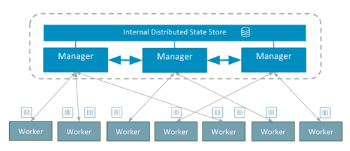

## Quelques rappels sur Docker Swarm

Swarm est la solution de clustering de Docker et permet entre autres:
- le management d’un cluster d’hôtes Docker
- l’orchestration de services sur ce cluster

Un cluster Swarm est composé de 2 types de nodes:
- les managers dont le rôle est de maintenir l’état du cluster. En interne, une implémentation de l’algorithme de consensus Raft est utilisée pour assurer cette fonction.
- les workers dont le rôle est d’exécuter des tasks (= lancer des containers)

Note: par défaut, un manager est également un worker.

Le schéma suivant montre la vision haut niveau d’un cluster Swarm.



Par défaut, un Swarm est sécurisé:
- encryption des logs nécessaires à la gestion du cluster
- communication TLS entre les différents nodes
- auto-rotation des certificats


Dans la suite, nous allons créer un cluster swarm en local composé d’un manager et de 2 workers.
Nous allons envisager différents cas de figure en fonction de la version de Docker:
- Docker Desktop (Mac), anciennement Docker for Mac
- Docker Desktop (Windows), anciennement Docker for Windows
- Docker for Ubuntu (ou pour d'autres distribution Linux)

Pour effectuer cela, nous utiliserons Docker Machine afin de créer 3 hôtes

## Création des hôtes avec Docker Machine

### Docker machine

Docker Machine est un utilitaire qui permet de créer une machine virtuelle et d'installer Docker, le client et le daemon, sur celle-ci. Il permet également de gérer le cycle de vie de ces hôtes Docker.

La commande suivante permet d'obtenir la liste des opérations qu'il est possible de faire avec docker-machine.

```
$ docker-machine --help
```

Si vous utilisez Docker Desktop ou Docker Toolbox, le binaire docker-machine est déjà disponible sur votre environnement. Dans les autres cas, il faudra l'installer, c'est un process très simple dont les instructions sont détaillées à l'adresse [https://docs.docker.com/machine/install-machine/](https://docs.docker.com/machine/install-machine/)

En fonction de l'environnement sur lequel vous êtes, il faudra utiliser le driver approprié ci-dessous.

### Docker Desktop (Windows)

L'édition Windows de Docker Desktop utilise l'hyperviseur **Hyper-V**, il faudra dans un premier temps créer un switch virtuel depuis l'interface de Hyper-V, puis ensuite utiliser le driver "hyperv" de docker-machine en précisant le nom de ce switch.

Dans l'exemple ci dessous on utilise un switch virtuel nommé **DMSwitch**.

```
PS C:\WINDOWS\system32> docker-machine create --driver hyperv --hyperv-virtual-switch "DMSwitch" node1
Running pre-create checks...
Creating machine...
(node1) Copying C:\Users\luc\.docker\machine\cache\boot2docker.iso to C:\Users\luc\.docker\machine\machines\node1\boot2docker.iso...
(node1) Creating SSH key...
(node1) Creating VM...
(node1) Using switch "DMSwitch"
(node1) Creating VHD
(node1) Starting VM...
(node1) Waiting for host to start...
Waiting for machine to be running, this may take a few minutes...
Detecting operating system of created instance...
Waiting for SSH to be available...
Detecting the provisioner...
Provisioning with boot2docker...
Copying certs to the local machine directory...
Copying certs to the remote machine...
Setting Docker configuration on the remote daemon...
Checking connection to Docker...
Docker is up and running!
To see how to connect your Docker Client to the Docker Engine running on this virtual machine, run: C:\Program Files\Docker\Docker\Resources\bin\docker-machine.exe env node1
```

De la même façon nous créeons les 2 autres hôtes, node2 et node3.

```
PS C:\WINDOWS\system32> docker-machine create --driver hyperv --hyperv-virtual-switch "DMSwitch" node2
PS C:\WINDOWS\system32> docker-machine create --driver hyperv --hyperv-virtual-switch "DMSwitch" node3
```

La commande suivante permet de lister les hôtes que nous venons de créer

```
PS C:\WINDOWS\system32> docker-machine ls
NAME    ACTIVE   DRIVER   STATE     URL                       SWARM   DOCKER        ERRORS
node1   -        hyperv   Running   tcp://192.168.1.25:2376           v18.09.1
node2   -        hyperv   Running   tcp://192.168.1.26:2376           v18.09.1
node3   -        hyperv   Running   tcp://192.168.1.27:2376           v18.09.1
```

### Docker Desktop (Mac)

Pour Docker for Mac, nous utilisons [Virtualbox](https://www.virtualbox.org/) afin d'instantier 3 machines virtuelles.

La commande suivante permet de créer un hôte nommé **node1**

```
$ docker-machine create --driver virtualbox node1
Running pre-create checks...
Creating machine...
(node1) Copying /Users/luc/.docker/machine/cache/boot2docker.iso to /Users/luc/.docker/machine/machines/node1/boot2docker.iso...
(node1) Creating VirtualBox VM...
(node1) Creating SSH key...
(node1) Starting the VM...
(node1) Check network to re-create if needed...
(node1) Waiting for an IP...
Waiting for machine to be running, this may take a few minutes...
Detecting operating system of created instance...
Waiting for SSH to be available...
Detecting the provisioner...
Provisioning with boot2docker...
Copying certs to the local machine directory...
Copying certs to the remote machine...
Setting Docker configuration on the remote daemon...
Checking connection to Docker...
Docker is up and running!
To see how to connect your Docker Client to the Docker Engine running on this virtual machine, run: docker-machine env node1
```

De la même façon nous créeons les 2 autres hôtes, node2 et node3.

```
$ docker-machine create --driver virtualbox node2
$ docker-machine create --driver virtualbox node3
```

Nous pouvons alors nous assurer que nos 3 hôtes sont en état de marche en lançant la commande suivante:

```
$ docker-machine ls
NAME    ACTIVE   DRIVER       STATE     URL                         SWARM   DOCKER        ERRORS
node1   -        virtualbox   Running   tcp://192.168.99.100:2376           v18.09.1
node2   -        virtualbox   Running   tcp://192.168.99.101:2376           v18.09.1
node3   -        virtualbox   Running   tcp://192.168.99.102:2376           v18.09.1
```

### Docker for Ubuntu

De la même façon que pour Docker Desktop, dans un environnement Linux nous utiliserons [Virtualbox](https://www.virtualbox.org/) afin d'instantier 3 machines virtuelles.

```
$ docker-machine create --driver virtualbox node1
Running pre-create checks...
(node1) Default Boot2Docker ISO is out-of-date, downloading the latest release...
(node1) Latest release for github.com/boot2docker/boot2docker is v18.09.1
(node1) Downloading /home/luc/.docker/machine/cache/boot2docker.iso from https://github.com/boot2docker/boot2docker/releases/download/v18.09.1/boot2docker.iso...
(node1) 0%....10%....20%....30%....40%....50%....60%....70%....80%....90%....100%
Creating machine...
(node1) Copying /home/luc/.docker/machine/cache/boot2docker.iso to /home/luc/.docker/machine/machines/node1/boot2docker.iso...
(node1) Creating VirtualBox VM...
(node1) Creating SSH key...
(node1) Starting the VM...
(node1) Check network to re-create if needed...
(node1) Waiting for an IP...
Waiting for machine to be running, this may take a few minutes...
Detecting operating system of created instance...
Waiting for SSH to be available...
Detecting the provisioner...
Provisioning with boot2docker...
Copying certs to the local machine directory...
Copying certs to the remote machine...
Setting Docker configuration on the remote daemon...
Checking connection to Docker...
Docker is up and running!
To see how to connect your Docker Client to the Docker Engine running on this virtual machine, run: docker-machine env node1
```

Nous répétons alors la procédure pour créer 2 autres hôtes Docker

```
$ docker-machine create --driver virtualbox node2
$ docker-machine create --driver virtualbox node3
```

De la même façon que précédemment, la commande suivante permet de s'assurer que les 3 hôtes sont en état de marche:

```
$ docker-machine ls
NAME    ACTIVE   DRIVER       STATE     URL                         SWARM   DOCKER        ERRORS
node1   -        virtualbox   Running   tcp://192.168.99.100:2376           v18.09.1
node2   -        virtualbox   Running   tcp://192.168.99.101:2376           v18.09.1
node3   -        virtualbox   Running   tcp://192.168.99.102:2376           v18.09.1
```

## Création du swarm

Maintenant que nous avons créé les 3 hôtes Docker, nous allons les mettre en cluster en créant un swarm.

### Initialisation à partir de node1

La commande suivante permet de nous connecter en ssh sur node1

```
$ docker-machine ssh node1
```

Nous pouvons ensuite initialiser le swarm

```
$ docker swarm init
Swarm initialized: current node (preife0qe9vjyum4rv13qm33l) is now a manager.

To add a worker to this swarm, run the following command:

    docker swarm join \
    --token SWMTKN-1-0jo31iectxf4uo4airmn1cepphe9mbg4j8j6276as56i6gi82c-8ggnqa3165gb0x8idf8tqs68p \
    10.0.107.3:2377

To add a manager to this swarm, run 'docker swarm join-token manager' and follow the instructions.
```

> Attention, lors de l'initialisation il est possible que vous obteniez une erreur semblable au message suivant
>
> ```
> Error response from daemon: could not choose an IP address to advertise since this system has multiple addresses on different > interfaces (10.0.2.15 on eth0 and 192.168.99.100 on eth1) - specify one with --advertise-addr
> ```
>
> Il faudra dans ce cas préciser l'adresse IP sur laquelle le manager sera accessible. On pourra initialiser le swarm avec la commande suivante:
>
> ```
> $ docker swarm init --advertise-addr 192.168.99.100
> ```

Le daemon Docker du node1 est maintenant en Swarm mode, nous pouvons lister les nodes de notre cluster.

```
$ docker node ls
ID                           HOSTNAME   STATUS   AVAILABILITY   MANAGER STATUS  ENGINE VERSION
tntzagkqg9uchatr8hzh8alio *  node1      Ready    Active         Leader          18.09.1
```

## Ajout des workers

Depuis les 2 autres terminaux, nous lançons la commande **docker swarm join...** obtenue lors de l’initialisation du Swarm.

```
$ docker swarm join \
    --token SWMTKN-1-0jo31iectxf4uo4airmn1cepphe9mbg4j8j6276as56i6gi82c-8ggnqa3165gb0x8idf8tqs68p \
    192.168.99.100:2377
```

Nous obtenons alors la réponse suivante

```
This node joined a swarm as a worker.
```

Depuis le node1 (seul manager de notre swarm), nous pouvons alors lister les nodes présents dans notre cluster.

```
$ docker node ls
ID                           HOSTNAME    STATUS  AVAILABILITY  MANAGER STATUS   ENGINE VERSION
tntzagkqg9uchatr8hzh8alio *  node1       Ready   Active        Leader           18.09.1
7avuhygyf15ia91kyotee6zxf    node2       Ready   Active                         18.09.1
ua03a3x0rtgrbnbnq2nifdtm2    node3       Ready   Active                         18.09.1
```

Le node1 est l’unique manager du cluster, node2 et node3 sont des workers.

Note: toutes les commandes du client Docker doivent être envoyées sur un manager, si nous lançons la commande précédente sur node2 ou node3, nous obtenons l’erreur suivante.

```
$ docker node ls
Error response from daemon: This node is not a swarm manager. Worker nodes can't be used to view or modify cluster state. Please run this command on a manager node or promote the current node to a manager.
Inspection d’un node
```

## Inspection d'un hôte

Comme pour les autres primitives de la plateforme (containers, images, volumes, networks), la commande inspect permet d’obtenir la vue détaillée d’un node.

```
$ docker node inspect node1
[
    {
        "ID": "jrqb09bsa47xb23pyrw0fgah4",
        "Version": {
            "Index": 9
        },
        "CreatedAt": "2017-11-03T14:00:17.670877138Z",
        "UpdatedAt": "2017-11-03T14:00:18.278047861Z",
        "Spec": {
            "Labels": {},
            "Role": "manager",
            "Availability": "active"
        },
        "Description": {
            "Hostname": "node1",
            "Platform": {
                "Architecture": "x86_64",
                "OS": "linux"
            },
            "Resources": {
                "NanoCPUs": 1000000000,
                "MemoryBytes": 1044123648
            },
            "Engine": {
                "EngineVersion": "17.10.0-ce",
                "Labels": {
                    "provider": "virtualbox"
                },
                "Plugins": [
                    {
                        "Type": "Log",
                        "Name": "awslogs"
                    },
                    {
                        "Type": "Log",
                        "Name": "fluentd"
                    },
                    {
                        "Type": "Log",
                        "Name": "gcplogs"
                    },
                    {
                        "Type": "Log",
                        "Name": "gelf"
                    },
                    {
                        "Type": "Log",
                        "Name": "journald"
                    },
                    {
                        "Type": "Log",
                        "Name": "json-file"
                    },
                    {
                        "Type": "Log",
                        "Name": "logentries"
                    },
                    {
                        "Type": "Log",
                        "Name": "splunk"
                    },
                    {
                        "Type": "Log",
                        "Name": "syslog"
                    },
                    {
                        "Type": "Network",
                        "Name": "bridge"
                    },
                    {
                        "Type": "Network",
                        "Name": "host"
                    },
                    {
                        "Type": "Network",
                        "Name": "macvlan"
                    },
                    {
                        "Type": "Network",
                        "Name": "null"
                    },
                    {
                        "Type": "Network",
                        "Name": "overlay"
                    },
                    {
                        "Type": "Volume",
                        "Name": "local"
                    }
                ]
            },
            "TLSInfo": {
                "TrustRoot": "-----BEGIN CERTIFICATE-----\nMIIBaTCCARCgAwIBAgIUIDgi01oBB7DgxX0wYvAaHBj8z14wCgYIKoZIzj0EAwIw\nEzERMA8GA1UEAxMIc3dhcm0tY2EwHhcNMTcxMTAzMTM1NTAwWhcNMzcxMDI5MTM1\nNTAwWjATMREwDwYDVQQDEwhzd2FybS1jYTBZMBMGByqGSM49AgEGCCqGSM49AwEH\nA0IABPOOT4AHEM48JwGIp0aiFDHRtXSVQm9yJoaM3awlok7zwVJfVcLWESVT7B9u\n4LQtjT5S1+ZUDa1UjQELWQtGaHajQjBAMA4GA1UdDwEB/wQEAwIBBjAPBgNVHRMB\nAf8EBTADAQH/MB0GA1UdDgQWBBTdFvlG+hSDdP+AFSL0ZiSEjetnWDAKBggqhkjO\nPQQDAgNHADBEAiB9atr7uP0eclaq06Z91kyOH8IYxXW9jxInIfNu37BtXgIgfqWu\nQ51iyG4tNLodPgyxefMEpQrFS/pfDGDlu2Timi4=\n-----END CERTIFICATE-----\n",
                "CertIssuerSubject": "MBMxETAPBgNVBAMTCHN3YXJtLWNh",
                "CertIssuerPublicKey": "MFkwEwYHKoZIzj0CAQYIKoZIzj0DAQcDQgAE845PgAcQzjwnAYinRqIUMdG1dJVCb3ImhozdrCWiTvPBUl9VwtYRJVPsH27gtC2NPlLX5lQNrVSNAQtZC0Zodg=="
            }
        },
        "Status": {
            "State": "ready",
            "Addr": "192.168.99.100"
        },
        "ManagerStatus": {
            "Leader": true,
            "Reachability": "reachable",
            "Addr": "192.168.99.100:2377"
        }
    }
]
```

Cette commande retourne entre autres:
- le status du node
- son rôle (manager vs worker)
- les plugins disponibles
- le certificat TLS

Nous pouvons utiliser les Go template afin d’obtenir une information précise contenue dans cette structure json. Par exemple, la commande suivante permet de récupérer l’adresse IP du node directement.

```
$ docker node inspect -f "{{ .Status.Addr }}" node1
```

## Mise à jour d’un node

Une fois les nodes crées, il est possible de changer leur rôle et de:
- promouvoir un worker en manager
- destituer un manager en worker

### Promotion de node2

La commande suivante permet de changer le node2 et d'en faire un manager

```
$ docker node promote node2
Node node2 promoted to a manager in the swarm.
```

Les commandes Docker peuvent maintenant être lancées depuis node1 ou node2 puisque tous 2 sont des managers.

```
$ docker node ls
ID                           HOSTNAME    STATUS  AVAILABILITY  MANAGER STATUS   ENGINE VERSION
tntzagkqg9uchatr8hzh8alio *  node1       Ready   Active        Leader           18.09.1
7avuhygyf15ia91kyotee6zxf    node2       Ready   Active        Reachable        18.09.1
ua03a3x0rtgrbnbnq2nifdtm2    node3       Ready   Active                         18.09.1
```

Le node2 a l’entrée Reachable dans la colonne MANAGER STATUS, ce qui signifie qu’il est du type manager, mais pas Leader.

### Destitution du node2

Depuis node1 ou node2, nous pouvons destituer le node2 et le repasser en worker.

```
$ docker node demote node2
Manager node2 demoted in the swarm.
```

Si nous listons une nouvelle fois les nodes du cluster, nous pouvons voir que le node2 n’a plus d’entrée dans la colonne MANAGER STATUS.

```
$ docker node ls
ID                           HOSTNAME    STATUS  AVAILABILITY  MANAGER STATUS   ENGINE VERSION
tntzagkqg9uchatr8hzh8alio *  node1       Ready   Active        Leader           18.09.1
7avuhygyf15ia91kyotee6zxf    node2       Ready   Active                         18.09.1
ua03a3x0rtgrbnbnq2nifdtm2    node3       Ready   Active                         18.09.1
```

## Résumé

Nous avons vu dans cet exercice la façon de créer un swarm en local, soit en utilisant VirtualBox soit en utilisant l'hyperviseur Hyper-V.
