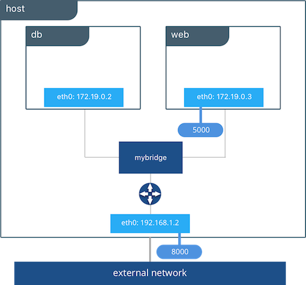

# Vue d'ensemble des networks

Dans cette mise en pratique, nous allons étudier la mise en réseau des containers Docker. Nous verrons notamment les networks qui sont crées par défaut lors de l’installation de la plateforme et nous passerons en revue différents drivers qui sont disponibles avec une installation standard.

## Pré-requis: création d'un hôte Docker

:fire: si vous avez déjà accès à une machine avec Docker, vous pouvez passer à l'étape suivante (1) directement.

Pour faire simple, nous allons créer un hôte Docker dans VirtualBox avec Vagrant. Cet hôte sera basé sur une machine virtuelles Ubuntu Bionic64.

Note: n'hésitez pas à utiliser d'autres outils et environnements si vous le souhaitez.

Assurez vous d'avoir [VirtualBox](https://www.virtualbox.org/) et [Vagrant](https://www.vagrantup.com/) installés sur votre machine.

Dans un nouveau répertoire, créez le fichier Vagrantfile avec le contenu suivant.

```
# -*- mode: ruby -*-
# vi: set ft=ruby :

Vagrant.configure("2") do |config|
  config.vm.define "node1" do |node|
    node.vm.box = "ubuntu/bionic64"
    node.vm.hostname = "node1"
    node.vm.network "private_network", ip: "192.168.33.10"
  end

  config.vm.provision "shell", inline: <<-SHELL
    curl -fsSL https://get.docker.com -o get-docker.sh
    sudo sh get-docker.sh
    sudo usermod -aG docker vagrant
    sudo apt-get install -y jq
  SHELL
end
```

Ce fichier définit une VM node1, avec l'adresse IP **192.168.33.10**. Cette VM sera configurée avec le daemon Docker.

Une fois le fichier créé, lancez le provionning avec la commande suivante.

```
$ vagrant up
```

Au bout de quelques minutes la VM sera prète à être utilisée. Pour y accéder en ssh il suffira de lancer la commande ```vagrant ssh node1``` depuis le répertoire dans lequel se trouve le fichier **Vagrantfile**.

## 1. Les networks créés par défaut

Lors de l’installation de la plateforme Docker, plusieurs networks sont créés. Connectez-vous en ssh sur le node1 et listez ces networks avec la commande suivante:

```
$ docker network ls
```

Vous obtiendrez un résultat similaire à celui ci-dessous (aux identifiants près):

```
NETWORK ID          NAME                DRIVER              SCOPE
78600647cf6b        bridge              bridge              local
f68b62cc1152        host                host                local
5a4a4afa414b        none                null                local
```

Lorsqu’un container est créé, nous pourrons spécifier le network auquel il sera attaché:

* un container attaché au network **none** n’aura pas de connectivité externe. Cela peut-être utile par exemple pour un container servant pour du debug
* un container attaché au network **host** bénéficiera de la stack network de la machine hôte
* un container attaché au network **bridge** pourra communiquer avec les autres containers attaché à ce network. Il faut cependant noter que ce type de network permet seulement une connectivité entre containers tournant sur la même machine

Avec la commande suivante, listez les interfaces de la machine hôte:

```
$ ip a
```

Vous obtiendrez un résultat similaire à celui ci-dessous (les noms de certaines interfaces pourront être différentes):

```
1: lo: <LOOPBACK,UP,LOWER_UP> mtu 65536 qdisc noqueue state UNKNOWN group default qlen 1000
    link/loopback 00:00:00:00:00:00 brd 00:00:00:00:00:00
    inet 127.0.0.1/8 scope host lo
       valid_lft forever preferred_lft forever
    inet6 ::1/128 scope host
       valid_lft forever preferred_lft forever
2: enp0s3: <BROADCAST,MULTICAST,UP,LOWER_UP> mtu 1500 qdisc fq_codel state UP group default qlen 1000
    link/ether 02:4d:82:c4:d5:87 brd ff:ff:ff:ff:ff:ff
    inet 10.0.2.15/24 brd 10.0.2.255 scope global dynamic enp0s3
       valid_lft 85937sec preferred_lft 85937sec
    inet6 fe80::4d:82ff:fec4:d587/64 scope link
       valid_lft forever preferred_lft forever
3: enp0s8: <BROADCAST,MULTICAST,UP,LOWER_UP> mtu 1500 qdisc fq_codel state UP group default qlen 1000
    link/ether 08:00:27:68:30:03 brd ff:ff:ff:ff:ff:ff
    inet 192.168.33.10/24 brd 192.168.33.255 scope global enp0s8
       valid_lft forever preferred_lft forever
    inet6 fe80::a00:27ff:fe68:3003/64 scope link
       valid_lft forever preferred_lft forever
4: docker0: <NO-CARRIER,BROADCAST,MULTICAST,UP> mtu 1500 qdisc noqueue state DOWN group default
    link/ether 02:42:ac:d1:34:9b brd ff:ff:ff:ff:ff:ff
    inet 172.17.0.1/16 brd 172.17.255.255 scope global docker0
       valid_lft forever preferred_lft forever
```

La chose importante à noter ici est l’existance d’une interface nommée **docker0**. C'est un bridge Linux qui a été créée lors de l’installation de la plateforme.

### 1.1. Lancement d’un container en utilisant le driver bridge

Par défaut, si l’option –-network n’est pas spécifiée au lancement d’un container, celui-ci est attaché au network nommé bridge.

Utilisez la  commande suivante pour lancer un container nommé c1 basé sur l’image alpine.

```
$ docker container run -d --name c1 alpine:3.8 sleep 10000
```

Note: nous spécifions sleep 10000 dans la commande de façon à ce que le processus de PID 1 de ce container tourne quelques temps

Avec la commande suivante, récupérer la configuration réseau de ce container (nous utilisons la notation Go template pour récupérer directement le champ qui nous intéresse (.NetworkSetings.Networks).

```
$ docker container inspect -f "{{ json .NetworkSettings.Networks }}" c1 | jq .
```

La sortie de cette commande nous donne l’ID du network auquel ce container est attaché, via la clé NetworkID. Nous pouvons alors voir que cette valeur correspond à l’ID du network **bridge**. Nous obtenons également d’autres information comme l’IP du container et celle de la passerelle.

```
{
    "bridge": {
        "Aliases": null,
        "DriverOpts": null,
        "EndpointID": "1968a1143dba15cad49dc84b06839b83e42d249a5ca6a83c06092840ad205364",
        "Gateway": "172.17.0.1",
        "GlobalIPv6Address": "",
        "GlobalIPv6PrefixLen": 0,
        "IPAMConfig": null,
        "IPAddress": "172.17.0.2",
        "IPPrefixLen": 16,
        "IPv6Gateway": "",
        "Links": null,
        "MacAddress": "02:42:ac:11:00:02",
        "NetworkID": "78600647cf6b67dbe6fcc0dcc9b06a59a0b5c36033fa088c030490959901ee16"
    }
}
```

Avec la commande suivante, inspectez le network bridge.

Note: cette commande utilise le formalisme Go template pour extraire la clé Containers afin d’obtenir la liste des containers attachés à ce network.

```
$ docker network inspect -f "{{ json .Containers }}" bridge | jq .
```

Vous devriez obtenir un résultat proche de celui ci-dessous, dans lequel le container **c1** est listé. On voit donc que **c1** est attaché au network.

```
{
    "3f41f1295700be13435e82df1e98f1575f4380cfdcb8b315e4b275485e4c2470": {
        "EndpointID": "1968a1143dba15cad49dc84b06839b83e42d249a5ca6a83c06092840ad205364",
        "IPv4Address": "172.17.0.2/16",
        "IPv6Address": "",
        "MacAddress": "02:42:ac:11:00:02",
        "Name": "c1"
    }
}
```

Supprimez le container **c1**.

```
$ docker rm -f c1
```

### 1.2. Lancement d’un container en utilisant le driver host


Avec la commande suivante, listez les interfaces réseau existantes sur la machine hôte.

```
$ ip link show
```

Vous devriez obtenir un résultat proche de celui ci-dessous.

```
1: lo: <LOOPBACK,UP,LOWER_UP> mtu 65536 qdisc noqueue state UNKNOWN qlen 1
    link/loopback 00:00:00:00:00:00 brd 00:00:00:00:00:00
2: docker0: <NO-CARRIER,BROADCAST,MULTICAST,UP> mtu 1500 qdisc noqueue state DOWN
    link/ether 02:42:4a:a3:69:00 brd ff:ff:ff:ff:ff:ff
50947: eth0@if50948: <BROADCAST,MULTICAST,UP,LOWER_UP,M-DOWN> mtu 1450 qdisc noqueue state UP
    link/ether 02:42:0a:00:a7:03 brd ff:ff:ff:ff:ff:ff
50949: eth1@if50950: <BROADCAST,MULTICAST,UP,LOWER_UP,M-DOWN> mtu 1500 qdisc noqueue state UP
    link/ether 02:42:ac:12:00:9d brd ff:ff:ff:ff:ff:ff
```

Lancez alors un shell interactif dans un container basé sur l’image alpine. Spécifiez l’option **–-network=host** de façon à ce que ce container utilise la stack network de la machine hôte.

```
$ docker container run -ti --name c1 --network=host alpine:3.8 sh
```

Une fois dans le container, listez les interfaces réseau.

```
# ip link show
```

La liste des interfaces devrait être la même que celle obtenue directement depuis la machine hôte.

Sortez du container et supprimez le.

```
# exit
$ docker rm c1
```

### 1.3. Lancement d’un container en utilisant le driver none

Lancez à présent un shell interactif dans un container basé sur l’image alpine mais cette fois en utilisant l’option **–-network=none** de façon à ne pas donner au container de connectivité vers l’extérieur.

```
$ docker container run -ti --name c1 --network none alpine:3.8 sh
```

Listez les interfaces réseau du container.

```
# ip a show
```

Vous devriez constater que seule **lo** (l’interface locale) est disponible.

```
1: lo: <LOOPBACK,UP,LOWER_UP> mtu 65536 qdisc noqueue state UNKNOWN qlen 1
    link/loopback 00:00:00:00:00:00 brd 00:00:00:00:00:00
    inet 127.0.0.1/8 scope host lo
       valid_lft forever preferred_lft forever
```

Depuis ce container, essayez de lancer un ping sur le DNS de Google (8.8.8.8).

```
# ping 8.8.8.8
```

Vous devriez obtenir le message d'erreur suivant, car ce container n'a pas de connection avec l’extérieur.

```
PING 8.8.8.8 (8.8.8.8): 56 data bytes
ping: sendto: Network unreachable
```

Sortez du container et supprimez le.

```
# exit
$ docker rm c1
```

## 2. Bridge network


Le réseau bridge créé par défaut permet à des containers tournant sur la même machine de communiquer entre eux comme nous allons le voir maintenant.


Dans cette partie, nous allons lancer 2 containers, chacun étant attaché au network  **bridge**. Il n’est pas nécessaire de spécifier l’option –-network car un container est attaché à ce network par défaut.

Utilisez la commande suivante pour lancer un premier container, nommé c1.

```
$ docker container run -d --name c1 alpine:3.8 sleep 10000
```

Avec la commande suivante, récupérer l'adresse IP du container.

```
$ docker container inspect -f "{{ .NetworkSettings.IPAddress }}" c1
```

Exemple de retour de cette commande:

```
172.17.0.2
```

Note: l’adresse IP obtenue sur votre environnement pourra être différente.

Utilisez la commande suivante pour lancer un shell interactif dans un second container basé sur l’image alpine, et nommé **c2**.

```
$ docker container run -ti --name c2 alpine:3.8 sh
```

Depuis ce shell, essayez de lancer un **ping** sur le container c1 en utilisant l’adresse IP de ce dernier.

Note: lancez la commande suivante en utilisant l’IP du container c1 obtenue précédemment.

```
# ping -c 3 172.17.0.2
PING 172.17.0.2 (172.17.0.2): 56 data bytes
64 bytes from 172.17.0.2: seq=0 ttl=64 time=0.135 ms
64 bytes from 172.17.0.2: seq=1 ttl=64 time=0.098 ms
64 bytes from 172.17.0.2: seq=2 ttl=64 time=0.110 ms
--- 172.17.0.2 ping statistics ---
3 packets transmitted, 3 packets received, 0% packet loss
round-trip min/avg/max = 0.098/0.114/0.135 ms
```

Cette commande fonctionne correctement, le container **c2** est capable de pinguer le container **c1** en utilisant l’adresse IP de ce dernier.

Toujours depuis le shell obtenu dans le container **c2**, lancez un ping vers **c1** mais cette fois-ci en utilisant le nom **c1** au lieu de son adresse IP.

```
# ping -c 3 c1
```

Vous devriez obtenir le message suivant:

```
ping: bad address 'c1'
```

Il n’est pas possible, pour des containers attachés au network bridge de communiquer via leur nom. Nous verrons que cela est par contre possible si nous définissons notre propre network de type bridge.

Sortez du container **c2** et supprimez **c1** et **c2**.

```
# exit
$ docker rm -f c1 c2
```

## 3. User defined bridge network

Nous avons vu que, par défaut, 3 networks sont définis (ceux-ci sont nommés bridge, host et none). Il est également possible d’en créer d’autres, c’est ce que nous allons voir dans les sections suivantes.



Utilisez la commande suivante afin de créer un nouveau network de type bridge nommé **bnet**.

```
$ docker network create --driver bridge bnet
```

Note: nous spécifions ici l’option –-driver bridge pour l’illustration même si ce n’est pas nécessaire car c’est le driver utilisé par défaut.

Utilisez la commande suivante pour lancer un container, nommé **c1** et attaché au network **bnet**.

```
$ docker container run -d --name c1 --network bnet alpine:3.8 sleep 10000
```

Comme précédemment, recupérez l’adresse IP de ce container.

Note: cette fois, nous utilisons la clé **.NetworkSettings.Networks.bnet.IPAddress**  afin de récupérer l’IP alouée sur le réseau bnet.

```
$ docker container inspect -f "{{ json .NetworkSettings.Networks.bnet.IPAddress }}" c1
```

Exemple de résultat obtenu:

```
172.18.0.2
```

Note: l’adresse IP obtenue sur votre environnement peux être différente.

Lancez un shell interactif dans un second container, nommé **c2**, et également attaché au network **bnet**.

```
$ docker container run -ti --name c2 --network bnet alpine:3.8 sh
```

Depuis **c2**, lancez un ping sur l'adress IP de **c1**.

```
# ping -c 3 172.18.0.2
```

Vous devriez obtenir un résultat similaire à celui ci-dessous:

```
PING 172.18.0.2 (172.18.0.2): 56 data bytes
64 bytes from 172.18.0.2: seq=0 ttl=64 time=1.557 ms
64 bytes from 172.18.0.2: seq=1 ttl=64 time=0.093 ms
64 bytes from 172.18.0.2: seq=2 ttl=64 time=0.088 ms
--- 172.18.0.2 ping statistics ---
3 packets transmitted, 3 packets received, 0% packet loss
round-trip min/avg/max = 0.088/0.579/1.557 ms
```

Nous pouvons constater que, comme c’est le cas pour le network bridge par défaut, les containers attachés au network **bnet** peuvent communiquer via leur adresse IP.

Comme précédemment, essayez de lancer un ping sur **c1** en utilisant le nom du container au lieu de son adresse IP.

```
# ping -c 3 c1
```

Vous devriez obtenir un résultat similaire à celui ci-dessous:

```
PING c1 (172.18.0.2): 56 data bytes
64 bytes from 172.18.0.2: seq=0 ttl=64 time=0.096 ms
64 bytes from 172.18.0.2: seq=1 ttl=64 time=0.095 ms
64 bytes from 172.18.0.2: seq=2 ttl=64 time=0.089 ms
--- c1 ping statistics ---
3 packets transmitted, 3 packets received, 0% packet loss
round-trip min/avg/max = 0.089/0.093/0.096 ms
```

Nous pouvons constater que, contrairement au cas du network bridge par défaut, les containers attachés au network **bnet** peuvent communiquer via leur nom, il y a une résolution de noms qui s'opère via un serveur DNS embarqué.

Sortez du container **c2** et supprimez c1 et c2.

```
# exit
$ docker rm -f c1 c2
```
