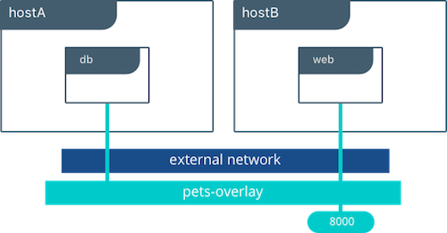

# Les networks dans un cluster swarm

Dans cette mise en pratique, nous allons créer un petit cluster Swarm contenant un manager et un worker, y déployer un service et regarder les différents network qui entrent en jeu.

# Création du Swarm

Pour faire simple, nous allons créer notre Swarm dans VirtualBox avec Vagrant. Chacun des nodes sera basé sur une machine virtuelle Ubuntu Bionic64.

Note: n'hésitez pas à créer un Swarm en utilisant d'autres outils et environnements si vous le souhaitez.

## Création des machines virtuelles avec Vagrant

Assurez vous d'avoir [VirtualBox](https://www.virtualbox.org/) et [Vagrant](https://www.vagrantup.com/) installés sur votre machine.

Dans un nouveau répertoire, créez le fichier Vagrantfile avec le contenu suivant.

```
# -*- mode: ruby -*-
# vi: set ft=ruby :

Vagrant.configure("2") do |config|
  config.vm.define "node1" do |node|
    node.vm.box = "ubuntu/bionic64"
    node.vm.hostname = "node1"
    node.vm.network "private_network", ip: "192.168.33.10"
  end

  config.vm.define "node2" do |node|
    node.vm.box = "ubuntu/bionic64"
    node.vm.hostname = "node2"
    node.vm.network "private_network", ip: "192.168.33.11"
  end

  config.vm.provision "shell", inline: <<-SHELL
    curl -fsSL https://get.docker.com -o get-docker.sh
    sudo sh get-docker.sh
    sudo usermod -aG docker vagrant
    sudo apt-get install -y ipvsadm jq
  SHELL
end
```

Ce fichier définit 2 VMs **node1** et **node2** , avec les IPs respectives **192.168.33.10** et **192.168.33.11**. Ces VMs seront configurées avec le daemon Docker et l'utilitaire **ipvsadm** pour administrer le load balancer IPVS présent dans le Kernel Linux. L'utilitaire **jq** est aussi installé pour permettre une meilleure mise en forme du résultat de différentes commandes.

Une fois le fichier créé, lancez le provionning avec la commande suivante.

```
$ vagrant up
```

Au bout de quelques minutes les VMs seront créées et configurées.

Note: pour accéder en ssh à l'une de ces machines il suffira de lancer la commande ```vagrant ssh node1``` ou ```vagrant ssh node2``` depuis le répertoire dans lequel se trouve le fichier **Vagrantfile**.

## Initialisation du Swarm

Maintenant que les machines sont prètes, connectez vous en ssh sur **node1** et initialisez un cluster Swarm avec la commande suivante:

```
$ docker swarm init --advertise-addr 192.168.33.10
```

Cette commande nous renvoie un résultat similaire à celui-ci

```
Swarm initialized: current node (vrto8yiuht7u28ey3faajwvr8) is now a manager.

To add a worker to this swarm, run the following command:

    docker swarm join --token TOKEN 192.168.33.10:2377

To add a manager to this swarm, run 'docker swarm join-token manager' and follow the instructions.
```

Pour ajouter node2 en tant que worker, connectez-vous en ssh sur node2 et lancez la commande suivante (en remplaçant **TOKEN** par le token qui a été retourné par la commande précédente):

```
$ docker swarm join --token TOKEN 192.168.33.10:2377
This node joined a swarm as a worker.
```

# Les networks créés par défaut

Connectez-vous en ssh sur le node1 et listez les networks avec la commande suivante.

```
$ docker network ls
NETWORK ID          NAME                DRIVER              SCOPE
958a37eac6f6        bridge              bridge              local
64f63d3cfe91        docker_gwbridge     bridge              local
a1705a570fb2        host                host                local
totcuhunqgcp        ingress             overlay             swarm
02f3e4feb2b1        none                null                local
```

En plus des networks **bridge**, **host** et **none**, 2 networks supplémentaires sont créés dans le cadre d'un Swarm:
- le network **ingress**, qui assure la connectivité depuis l’exterieur et la fonction de routing mesh. Ce network est de type overlay, il s'étend via la technologie VXLAN sur les 2 nodes du cluster
- le network **docker_gwbridge**, qui assure la connectivité vers l’extérieur (egress)

# Création d'un network de type overlay

Alors qu’un network de type bridge permet une connectivité entre les containers qui tournent sur la même machine hôte, un network de type overlay permet d’étendre la connectivité entre des containers qui tournent sur des machines différentes. Un network de type overlay ne peut être créé que dans un contexte de cluster d’hôtes Docker




Afin de permettre la connectivité entre des containers tournant sur les différents hôtes du cluster, nous allons créer un network de type overlay que nous appelerons **ovnet**. Sur le node1, lancez la commande suivante:

```
$ docker network create --driver overlay ovnet
```

Le network **ovnet** est présent dans la liste des networks du système comme le montre la liste des networks:

```
$ docker network ls --filter name=ovnet
NETWORK ID          NAME                DRIVER              SCOPE
zmbsvp773jch        ovnet               overlay             swarm
```

# Création d'un service

Pour illustrer l'utilisation des networks, nous allons créer un service:
- dont le nom est **www**
- définissant **2** réplicas
- attaché au network **ovnet**
- publiant le port **80** sur le port **8888** des nodes du Swarm
- basé sur l'image **nginx:1.14-alpine**

Créez ce service avec la commande suivante:

```
$ docker service create \
  --name www \
  --replicas 2 \
  --network ovnet \
  --publish 8888:80 \
  nginx:1.14-alpine
```

## Répartition des réplicas

A priori, chaque node du Swarm devrait contenir un réplica du service (le scheduler de Swarm fonctionne en mode **spread** par défaut). Vérifiez que c'est bien le cas avec la commande suivante:

```
$ docker service ps www
ID           NAME   IMAGE              NODE   DESIRED STATE  CURRENT STATE           ERROR  PORTS
w1iwcy57ihkj www.1  nginx:1.14-alpine  node1  Running        Running 42 seconds ago
8bau2aslhpnj www.2  nginx:1.14-alpine  node2  Running        Running 42 seconds ago
```

La commande d'inspection du service permet de connaitre le ou les VIPs (adresse IP virtuelles) associées:

```
$ docker service inspect www
[
    ...
    "VirtualIPs": [
        {
            "NetworkID": "totcuhunqgcpw26q2cbh7apcn",
            "Addr": "10.255.0.4/16"
        },
        {
            "NetworkID": "zmbsvp773jcht1c31bn6lieew",
            "Addr": "10.0.0.2/24"
        }
    ]
]
```

Le service **www** à 2 VIPs:
- la VIP **10.255.0.4** sur le network **ingress**: cette VIP est utilisée pour le load balancing du traffic, à destination du service, qui provient de l'extérieur
- la VIP **10.0.0.2** sur le network **ovnet**: cette VIP est utilisée pour le load balancing du traffic, à destination du service **www**, qui provient du network **ovnet** (communication avec d'autres services qui seraient attachés à ce network)

Note: les VIPs que vous obtiendrez pourront être différentes de celles obtenues dans cet exemple.

**A retenir**: une requète arrivant sur l'une de ces VIPs sera load balancée entre les différents containers du service

# Network namespaces

L’initialisation du swarm, la création du réseau overlay et des containers du service **www** ont créé différents namespaces network, en plus du namespace root, sur chaque node du cluster. Un namespace network permet d'isoler un ensemble d'interfaces réseau, des règles de routage, ... On va examiner ces différents namespaces dans la suite.

## Root namespace

Le root network namespace est le namespace network de la machine hôte.
Avec la commande suivante, listez les interfaces disponibles sur le node1.

```
$ ip a
```

Vous obtiendrez un résultat proche de celui ci-dessous (certaines de vos interfaces pourront cependant être différentes)

```
1: lo: <LOOPBACK,UP,LOWER_UP> mtu 65536 qdisc noqueue state UNKNOWN group default qlen 1000
    link/loopback 00:00:00:00:00:00 brd 00:00:00:00:00:00
    inet 127.0.0.1/8 scope host lo
       valid_lft forever preferred_lft forever
    inet6 ::1/128 scope host
       valid_lft forever preferred_lft forever
2: enp0s3: <BROADCAST,MULTICAST,UP,LOWER_UP> mtu 1500 qdisc fq_codel state UP group default qlen 1000
    link/ether 02:4d:82:c4:d5:87 brd ff:ff:ff:ff:ff:ff
    inet 10.0.2.15/24 brd 10.0.2.255 scope global enp0s3
       valid_lft forever preferred_lft forever
    inet6 fe80::4d:82ff:fec4:d587/64 scope link
       valid_lft forever preferred_lft forever
3: enp0s8: <BROADCAST,MULTICAST,UP,LOWER_UP> mtu 1500 qdisc fq_codel state UP group default qlen 1000
    link/ether 08:00:27:f0:23:26 brd ff:ff:ff:ff:ff:ff
    inet 192.168.33.10/24 brd 192.168.33.255 scope global enp0s8
       valid_lft forever preferred_lft forever
    inet6 fe80::a00:27ff:fef0:2326/64 scope link
       valid_lft forever preferred_lft forever
4: docker0: <NO-CARRIER,BROADCAST,MULTICAST,UP> mtu 1500 qdisc noqueue state DOWN group default
    link/ether 02:42:76:3f:dc:4b brd ff:ff:ff:ff:ff:ff
    inet 172.17.0.1/16 brd 172.17.255.255 scope global docker0
       valid_lft forever preferred_lft forever
9: docker_gwbridge: <BROADCAST,MULTICAST,UP,LOWER_UP> mtu 1500 qdisc noqueue state UP group default
    link/ether 02:42:5a:8c:ea:f9 brd ff:ff:ff:ff:ff:ff
    inet 172.18.0.1/16 brd 172.18.255.255 scope global docker_gwbridge
       valid_lft forever preferred_lft forever
    inet6 fe80::42:5aff:fe8c:eaf9/64 scope link
       valid_lft forever preferred_lft forever
11: vethdbc5bea@if10: <BROADCAST,MULTICAST,UP,LOWER_UP> mtu 1500 qdisc noqueue master docker_gwbridge state UP group default
    link/ether 8e:eb:47:d0:2a:bf brd ff:ff:ff:ff:ff:ff link-netnsid 1
    inet6 fe80::8ceb:47ff:fed0:2abf/64 scope link
       valid_lft forever preferred_lft forever
18: veth7e8cab9@if17: <BROADCAST,MULTICAST,UP,LOWER_UP> mtu 1500 qdisc noqueue master docker_gwbridge state UP group default
    link/ether ba:c9:79:8c:cc:3a brd ff:ff:ff:ff:ff:ff link-netnsid 4
    inet6 fe80::b8c9:79ff:fe8c:cc3a/64 scope link
       valid_lft forever preferred_lft forever
```

On trouve les bridges **docker0** et **docker_gwbridge**. Sur ce dernier, 2 interfaces virtuelles sont attachées (celles dont le nom commence par **veth**). Chacune d'entre elles fait partie d'une paire d'interfaces virtuelles dont l'autre extrémité est attachée à un autre namespace network. On reviendra sur ces paires d'interfaces dans la suite.

Avec la commande suivante, affichez la table **nat** configurez dans le système. Elle permettra de voir le chemin que prennent les paquets entrant par l'une des interfaces réseau de la machine hôte.

```
$ sudo iptables -t nat -nvL
```

Vous obtiendrez un résultat similaire à celui ci-dessous:

```
Chain PREROUTING (policy ACCEPT 64 packets, 6064 bytes)
 pkts bytes target          prot opt in  out   source      destination
   46  2760 DOCKER-INGRESS  all  --  *   *     0.0.0.0/0   0.0.0.0/0      ADDRTYPE match dst-type LOCAL
   59  3508 DOCKER          all  --  *   *     0.0.0.0/0   0.0.0.0/0      ADDRTYPE match dst-type LOCAL

Chain INPUT (policy ACCEPT 64 packets, 6064 bytes)
 pkts bytes target     prot opt in       out   source       destination

Chain OUTPUT (policy ACCEPT 48 packets, 2880 bytes)
 pkts bytes target          prot opt in  out   source       destination
    0     0 DOCKER-INGRESS  all  --  *   *     0.0.0.0/0    0.0.0.0/0     ADDRTYPE match dst-type LOCAL
    0     0 DOCKER          all  --  *   *     0.0.0.0/0    !127.0.0.0/8  ADDRTYPE match dst-type LOCAL

Chain POSTROUTING (policy ACCEPT 48 packets, 2880 bytes)
 pkts bytes target      prot opt in out              source        destination
    0     0 MASQUERADE  all  --  *  docker_gwbridge  0.0.0.0/0     0.0.0.0/0 ADDRTYPE match src-type LOCAL
    0     0 MASQUERADE  all  --  *  !docker_gwbridge 172.18.0.0/16 0.0.0.0/0
    0     0 MASQUERADE  all  --  *  !docker0         172.17.0.0/16 0.0.0.0/0

Chain DOCKER (2 references)
 pkts bytes target     prot opt in              out  source     destination
    0     0 RETURN     all  --  docker_gwbridge *    0.0.0.0/0  0.0.0.0/0
    0     0 RETURN     all  --  docker0         *    0.0.0.0/0  0.0.0.0/0

Chain DOCKER-INGRESS (2 references)
 pkts bytes target     prot opt in  out  source     destination
    0     0 DNAT       tcp  --  *   *    0.0.0.0/0  0.0.0.0/0     tcp dpt:8888 to:172.18.0.2:8888
   46  2760 RETURN     all  --  *   *    0.0.0.0/0  0.0.0.0/0
```

On voit notamment dans la dernière partie, dans la target **DNAT** de la chaine DOCKER-INGRESS, qu'un paquet qui arrive sur le port **8888** est redirigée sur le port **8888** sur l'adresse ip **172.18.0.2**. D'après ce que l'on a vu précédemment, on voit que cette adresse IP est obtenue sur le range d'IP du bridge **docker_gwbridge** (172.18.0.1/16), c'est une adresse locale au node.

Avec la commande suivante, listez les containers attaché au network **docker_gwbridge**.


```
$ docker network inspect -f '{{ .Containers }}' docker_gwbridge
```

Parmi ces containers, il y a container nommé **ingress_sbox** qui a l'adresse IP **172.18.0.2**. Ce container n'est pas visible avec les commandes docker mais il dispose néanmoins de son propre network namespace. C'est donc dans le network namespace de ce container que les paquets arrivant sur le port **8888** de l'hôte sont envoyés.

```
"ingress-sbox": {
   "Name": "gateway_ingress-sbox",
   "EndpointID": "ff31501277dcab1a412f4c944238f09c46c405300ad7a8b7572d0c4dcd511538",
   "MacAddress": "02:42:ac:12:00:02",
   "IPv4Address": "172.18.0.2/16",
   "IPv6Address": ""
```

**En résumé**: les paquets arrivant sur le port 8888 du node1 sont forwardés sur le port 8888 du container **ingress_sbox** attaché au bridge **docker_gwbridge**. Le même flux serait observé sur le node2.

## Les namespaces additionels

Chaque network namespace définit ses propres interfaces réseau et règles de routage. Dans ce qui suit, on va éxaminer les namespaces présent sur le node1, on aurait les mêmes résultats depuis le node2.

Avec la commande suivante, listez les différents network namespaces qui ont été créés sur node1.

```
$ sudo ls /var/run/docker/netns
```

Le résultat obtenu sur similaire à celui ci-dessous, les identifiants seront par contre différents.

```
1-totcuhunqg  1-zmbsvp773j  32eeab89b26b  ingress_sbox	lb_zmbsvp773
```

Listez une nouvelle fois les networks existants sur le node1.

```
$ docker network ls
NETWORK ID          NAME                DRIVER              SCOPE
958a37eac6f6        bridge              bridge              local
64f63d3cfe91        docker_gwbridge     bridge              local
a1705a570fb2        host                host                local
totcuhunqgcp        ingress             overlay             swarm
02f3e4feb2b1        none                null                local
zmbsvp773jch        ovnet               overlay             swarm
```

Certains rapprochements entre les noms de ces namespaces et les identifiants des networks peuvent déjà être réalisés.

Les namespaces des networks de type **overlay** sont par exemple facilement identifiables:

| Network Name  | Network ID   | Namespace    |
| ------------- |--------------|--------------|
| ingress       | totcuhunqgcp | 1-totcuhunqg |
| ovnet         | zmbsvp773jch | 1-zmbsvp773j |


De plus, comme on le verra dans la suite:
- le namespace **ingres_sbox** correspond au namespace du container du même nom, attaché au **docker_gwbridge** et utilisé pour le routing Mesh
- le namespace **lb_zmbsvp773** correspond au namespace du container **lb-ovnet**, attaché au bridge **br0** du network **ovnet**, et utilisé dans le load balancing des containers des services attachés à ce network
- le namespace **32eeab89b26b** correspond au namespace du container du service **www** tournant sur le node1

Dans la suite nous lancerons différentes commandes dans ces namespaces à l'aide de l'utilitaire **nsenter**

**En résumé**: un paquet entrant sur le Swarm va naviguer entre différents network namespaces avant d'arriver à destination et être traité par le container du service constituant l'application.

# Routing Mesh

Le routing Mesh est une fonctionnalités qui a été introduite dans la version 1.12 de Docker (la version dans laquelle est également apparu Swarm mode). Lorsqu'un service déployé sur un Swarm publie un port, celui-ci est accessible depuis n'importe quel node du cluster. Si le node sur lequel la requète arrive n'a pas de réplica pour le service concerné, elle sera automatiquement forwardée à l'un des containers du service tournant sur un autre node.

Différents mécanismes entrent en jeu pour le routing mesh, nous allons les voir en étudiant plusieurs namespaces.

## Namespaces ingress_sbox

Avec la commande suivante, listez les interfaces définies dans le namespace **ingress_sbox**, ce namespace correspond au network namespace du container **ingres_sbox**.

```
$ sudo nsenter --net=/var/run/docker/netns/ingress_sbox ip a
```

Vous obtiendrez un résultat ressemblant à celui ci-dessous:

```
1: lo: <LOOPBACK,UP,LOWER_UP> mtu 65536 qdisc noqueue state UNKNOWN group default qlen 1000
    link/loopback 00:00:00:00:00:00 brd 00:00:00:00:00:00
    inet 127.0.0.1/8 scope host lo
       valid_lft forever preferred_lft forever
7: eth0@if8: <BROADCAST,MULTICAST,UP,LOWER_UP> mtu 1450 qdisc noqueue state UP group default
    link/ether 02:42:0a:ff:00:02 brd ff:ff:ff:ff:ff:ff link-netnsid 0
    inet 10.255.0.2/16 brd 10.255.255.255 scope global eth0
       valid_lft forever preferred_lft forever
    inet 10.255.0.4/32 brd 10.255.0.4 scope global eth0
       valid_lft forever preferred_lft forever
10: eth1@if11: <BROADCAST,MULTICAST,UP,LOWER_UP> mtu 1500 qdisc noqueue state UP group default
    link/ether 02:42:ac:12:00:02 brd ff:ff:ff:ff:ff:ff link-netnsid 1
    inet 172.18.0.2/16 brd 172.18.255.255 scope global eth1
       valid_lft forever preferred_lft forever
```

On y trouve l'interface **eth1@if11** (numérotée 10), qui est l'autre extrémité de linterface **vethdbc5bea@if10** (numérotée 11) attachée au bridge **docker_gwbridge** du node1. Cette paire d'interfaces virtuelles permet de lier le namespace network du container **ingress_sbox** avec le namespace root de la machine hôte (node1).

Note: dans votre contexte, les noms des interfaces pourront être différents

Avec la commande suivante, affichez le contenu de la table **nat** afin de voir le cheminemment d'un paquet qui arrive dans le namespace **ingress_sbox**.

```
$ sudo nsenter --net=/var/run/docker/netns/ingress_sbox iptables -t nat -nvL
```

Vous devriez obtenir un resultat proche de celui ci-dessous:

```
Chain PREROUTING (policy ACCEPT 0 packets, 0 bytes)
 pkts bytes target     prot opt in     out     source               destination

Chain INPUT (policy ACCEPT 0 packets, 0 bytes)
 pkts bytes target     prot opt in     out     source               destination

Chain OUTPUT (policy ACCEPT 4 packets, 276 bytes)
 pkts bytes target         prot opt in     out     source        destination
    0     0 DOCKER_OUTPUT  all  --  *      *       0.0.0.0/0     127.0.0.11

Chain POSTROUTING (policy ACCEPT 4 packets, 276 bytes)
 pkts bytes target              prot opt in     out     source         destination
    0     0 DOCKER_POSTROUTING  all  --  *      *       0.0.0.0/0      127.0.0.11
    0     0 SNAT                all  --  *      *       0.0.0.0/0      10.255.0.0/16        ipvs to:10.255.0.2

Chain DOCKER_OUTPUT (1 references)
 pkts bytes target     prot opt in     out     source               destination
    0     0 DNAT       tcp  --  *      *       0.0.0.0/0            127.0.0.11           tcp dpt:53 to:127.0.0.11:43645
    0     0 DNAT       udp  --  *      *       0.0.0.0/0            127.0.0.11           udp dpt:53 to:127.0.0.11:50354

Chain DOCKER_POSTROUTING (1 references)
 pkts bytes target     prot opt in     out     source               destination
    0     0 SNAT       tcp  --  *      *       127.0.0.11           0.0.0.0/0            tcp spt:43645 to::53
    0     0 SNAT       udp  --  *      *       127.0.0.11           0.0.0.0/0            udp spt:50354 to::53
```

Si on laisse de côté les règles qui sont relatives à la résolution DNS (celles faisant apparaitre l'IP 127.0.0.11 à laquelle est accessible le serveur DNS du daemon Docker), on voit que la chaine **POSTROUTING** fait un NAT des paquets à destination du range 10.255.0.0/16. La source de ces paquets sera donc modifiée avec la valeur retournée par le module IPVS disponible via l'ip **10.255.0.2** (cette IP est celles de l'interface **eth0** dans le namespace **ingres_sbox**).

Avec la commande suivante, affichez la table **mangle** afin de voir comment les paquets sont modifiés dans le container **ingress_sbox** avant d'être pris en charge par le module IPVS.

```
$ sudo nsenter --net=/var/run/docker/netns/ingress_sbox iptables -t mangle -nvL
```

Vous devriez obtenir un resultat proche de celui ci-dessous:

```
Chain PREROUTING (policy ACCEPT 8 packets, 664 bytes)
 pkts bytes target     prot opt in     out     source               destination
    0     0 MARK       tcp  --  *      *       0.0.0.0/0            0.0.0.0/0            tcp dpt:8888 MARK set 0x100

Chain INPUT (policy ACCEPT 8 packets, 664 bytes)
 pkts bytes target     prot opt in     out     source               destination
    0     0 MARK       all  --  *      *       0.0.0.0/0            10.255.0.4           MARK set 0x100

Chain FORWARD (policy ACCEPT 0 packets, 0 bytes)
 pkts bytes target     prot opt in     out     source               destination

Chain OUTPUT (policy ACCEPT 8 packets, 664 bytes)
 pkts bytes target     prot opt in     out     source               destination

Chain POSTROUTING (policy ACCEPT 8 packets, 664 bytes)
 pkts bytes target     prot opt in     out     source               destination
```

On voit ici que les paquets à destination du port 8888 sont flagés avec la valeur 0x100 (256). Cette valeur sera utilisée dans la suite par le module IPVS. Les paquets à destination de l'IP **10.255.0.4** (VIP du service **www** sur le network **ingress**) sont également flaggé avec la même valeur.

Toujours dans le namespace **ingress_sbox**, utilisez la commande suivante pour voir la configuration du module IPVS.

```
$ sudo nsenter --net=/var/run/docker/netns/ingress_sbox ipvsadm -L
```

Vous devriez obtenir un resultat proche de celui ci-dessous:

```
IP Virtual Server version 1.2.1 (size=4096)
Prot LocalAddress:Port Scheduler Flags
  -> RemoteAddress:Port           Forward Weight ActiveConn InActConn
FWM  256 rr
  -> 10.255.0.5:0                 Masq    1      0          0
  -> 10.255.0.6:0                 Masq    1      0          0
```

On voit ici que le paquet sera load balancé entre les IPs **10.255.0.5** et **10.255.0.6**. Ces IPs correspondent aux IPs des réplicas du service **www** sur le network **ingress**.

Pour le vérifier, lancer la commande suivante sur le node1 puis sur le node2:

```
$ docker network inspect -f '{{ json .Containers }}' ingress | jq .
```

Vous devriez obtenir un resultat proche du résultat suivant:

- sur le node1:

```
"a40b052a2ec8a75dcb945eb7878133ff72c63b2dd3120190e17a1aaa021c89f7": {
  "Name": "www.1.w1iwcy57ihkjlbq7cqbtvm7g1",
  "EndpointID": "39845c4ab6d5e7f6f71e3f743bc1140853851408f76fe100abd2c1047ee5b30f",
  "MacAddress": "02:42:0a:ff:00:06",
  "IPv4Address": "10.255.0.6/16",
  "IPv6Address": ""
```

- sur le node2:

```
"e2f982ed3f26b713c234829e1d42fa281a214c68443bcebff91627d67d8974d0": {
  "Name": "www.2.8bau2aslhpnjcaildertac3mq",
  "EndpointID": "c9564e6de9df7f46e36105a67dc0b1acf2053668474f13834cff0d42aa296972",
  "MacAddress": "02:42:0a:ff:00:05",
  "IPv4Address": "10.255.0.5/16",
  "IPv6Address": ""
```

Le paquet passera dans le network namespace du network **ingress** pour accéder au container dont l'IP est retournée par IPVS. Si cette IP n'est pas locale au node, le network ingress enverra le paquet via un VXLAN sur l'autre node du cluster.

**En résumé**: lorsqu'un paquet arrive dans le namespace **ingress_sbox**, il est tout d'abord flagé avec une valeur particulière puis redirigé vers le module IPVS. Le paquet sera ensuite redirigé vers l'IP, retourné par le module IPVS, de l'un des containers de l'application.

## Namespace du network ingress

Comme on l'a dit précédemment, le network **ingress** est un network de type overlay, il s'étend via un VXLAN sur les différents nodes du cluster. Il définit son propre namespace dont le nom contient une partie de l'identifiant du network.

Avec la commande suivante, listez les interfaces présentes dans ce namespace:

Note: on détermine tout d'abord le nom du namespace lié au network **ingress** à partir de l'identifiant de celui-ci.

```
NAMESPACE_INGRESS="1-$(docker network ls -f name=ingress -q | cut -c 1-10)"
nsenter --net=/var/run/docker/netns/$NAMESPACE_INGRESS ip a
```

Vous devriez obtenir un résultat proche de celui ci-dessous:

```
1: lo: <LOOPBACK,UP,LOWER_UP> mtu 65536 qdisc noqueue state UNKNOWN group default qlen 1000
    link/loopback 00:00:00:00:00:00 brd 00:00:00:00:00:00
    inet 127.0.0.1/8 scope host lo
       valid_lft forever preferred_lft forever
2: br0: <BROADCAST,MULTICAST,UP,LOWER_UP> mtu 1450 qdisc noqueue state UP group default
    link/ether 6a:6a:8b:8a:dc:6c brd ff:ff:ff:ff:ff:ff
    inet 10.255.0.1/16 brd 10.255.255.255 scope global br0
       valid_lft forever preferred_lft forever
6: vxlan0: <BROADCAST,MULTICAST,UP,LOWER_UP> mtu 1450 qdisc noqueue master br0 state UNKNOWN group default
    link/ether 92:21:d9:b8:9f:fa brd ff:ff:ff:ff:ff:ff link-netnsid 0
8: veth0@if7: <BROADCAST,MULTICAST,UP,LOWER_UP> mtu 1450 qdisc noqueue master br0 state UP group default
    link/ether 6a:6a:8b:8a:dc:6c brd ff:ff:ff:ff:ff:ff link-netnsid 1
16: veth1@if15: <BROADCAST,MULTICAST,UP,LOWER_UP> mtu 1450 qdisc noqueue master br0 state UP group default
    link/ether e6:91:a7:d6:08:5b brd ff:ff:ff:ff:ff:ff link-netnsid 2
```

Dans cette exemple il y a 3 interfaces, chacune attachée au bridge **br0** créé dans le namespace du network **ingress**.

On peut voir ici que l'interface **veth0@if7** (numérotée 8) correspond à l'autre extémité de l'interface **eth0@if8** (numérotée 7) présente dans le namespace **ingress_sbox**. Cette paire d'interface virtuelle permet de lier le namespace **ingress_sbox** et le namespace du network **ingress**, et ainsi d'acheminer le traffic **10.255.0.0/16** vers le network **ingress**.

On verra plus loin que l'interface **veth1@if15** est l'extémité d'une paire d'interfaces virtuelles dont l'autre extrémité est attachée au container de l'application qui tourne sur le node1 actuel.

Dans le cas ou le paquet doit être envoyé à un container tournant sur l'autre node du cluster (ceci dépend de l'adresse IP retournée par le module IPVS), il passera par l'interface **vxlan0** (le network **ingress** utilise la technologie VXLAN pour s'étendre sur les différents nodes du cluster). Il arrivera ainsi sur le network **ingress** de l'autre node et sera acheminé sur le container de l'application.

**En résumé**: lorsqu'un paquet, en provenance du container **ingress_sbox**, est reçu par le network **ingress** il est envoyé sur l'un des containers du service. Soit directement si le container est local à la machine, soit via un vxlan si le container tourne sur une autre machine du cluster.

## Namespace du container

Avec les commandes suivantes, examinez les interfaces présentes dans le namespace du container du service **www** tournant sur node1.

Note: on détermine tout d'abord le nom du container à partir de l'identifiant du service

```
CONTAINER_NAME=www.1.$(docker service ps -f name=www.1 -q www)
NAMESPACE_CTN=$(docker inspect -f '{{ .NetworkSettings.SandboxKey }}' $CONTAINER_NAME)
sudo nsenter --net=$NAMESPACE_CTN ip a
```

Vous devriez obtenir un résultat similaire au résultat suivant:

```
1: lo: <LOOPBACK,UP,LOWER_UP> mtu 65536 qdisc noqueue state UNKNOWN group default qlen 1000
    link/loopback 00:00:00:00:00:00 brd 00:00:00:00:00:00
    inet 127.0.0.1/8 scope host lo
       valid_lft forever preferred_lft forever
15: eth0@if16: <BROADCAST,MULTICAST,UP,LOWER_UP> mtu 1450 qdisc noqueue state UP group default
    link/ether 02:42:0a:ff:00:06 brd ff:ff:ff:ff:ff:ff link-netnsid 0
    inet 10.255.0.6/16 brd 10.255.255.255 scope global eth0
       valid_lft forever preferred_lft forever
17: eth2@if18: <BROADCAST,MULTICAST,UP,LOWER_UP> mtu 1500 qdisc noqueue state UP group default
    link/ether 02:42:ac:12:00:03 brd ff:ff:ff:ff:ff:ff link-netnsid 2
    inet 172.18.0.3/16 brd 172.18.255.255 scope global eth2
       valid_lft forever preferred_lft forever
19: eth1@if20: <BROADCAST,MULTICAST,UP,LOWER_UP> mtu 1450 qdisc noqueue state UP group default
    link/ether 02:42:0a:00:00:04 brd ff:ff:ff:ff:ff:ff link-netnsid 1
    inet 10.0.0.4/24 brd 10.0.0.255 scope global eth1
       valid_lft forever preferred_lft forever
```

Les interfaces listées ici font chacune partie de paires d'interfaces virtuelles qui relient le network namespace du container avec d'autres namespaces et qui permettent ainsi la communication entre ces namespaces.

- **eth0** permet d'attacher le container au network **ingress**
- **eth2** permet d'attacher le container au network **docker_gwbridge**
- **eth1** permet d'attacher le container au network **ovnet** (comme on va le voir juste après)

# Communication entre les services

Nous avons vu dans les paragraphes précédents les différents éléments qui entrent en jeu dans le fonctionnement du routing mesh. Le principe est le même pour la communication entre différents service communiquant au travers d'un network de type overlay autre que **ingress**.
Nous allons explorer le network **ovnet** et un container attaché à celui-ci dans lequel sont implémentées les règles de routage et le load balancing.

## Namespace du network ovnet

Utilisez les commandes suivantes pour lister les interfaces réseau présentes dans le namespace du network **ovnet**:

Note: on détermine tout d'abord le nom du namespace lié au network **ovnet** à partir de l'identifiant de celui-ci.

```
NAMESPACE_OVNET="1-$(docker network ls -f name=ovnet -q | cut -c 1-10)"
sudo nsenter --net=/var/run/docker/netns/$NAMESPACE_OVNET ip a
```

Vous devriez obtenir un résultat proche de celui présnté ci-dessous:

```
1: lo: <LOOPBACK,UP,LOWER_UP> mtu 65536 qdisc noqueue state UNKNOWN group default qlen 1000
    link/loopback 00:00:00:00:00:00 brd 00:00:00:00:00:00
    inet 127.0.0.1/8 scope host lo
       valid_lft forever preferred_lft forever
2: br0: <BROADCAST,MULTICAST,UP,LOWER_UP> mtu 1450 qdisc noqueue state UP group default
    link/ether 3a:58:8b:63:ac:9b brd ff:ff:ff:ff:ff:ff
    inet 10.0.0.1/24 brd 10.0.0.255 scope global br0
       valid_lft forever preferred_lft forever
12: vxlan0: <BROADCAST,MULTICAST,UP,LOWER_UP> mtu 1450 qdisc noqueue master br0 state UNKNOWN group default
    link/ether f2:02:2c:36:72:a7 brd ff:ff:ff:ff:ff:ff link-netnsid 0
14: veth0@if13: <BROADCAST,MULTICAST,UP,LOWER_UP> mtu 1450 qdisc noqueue master br0 state UP group default
    link/ether 96:02:75:c6:66:30 brd ff:ff:ff:ff:ff:ff link-netnsid 1
20: veth1@if19: <BROADCAST,MULTICAST,UP,LOWER_UP> mtu 1450 qdisc noqueue master br0 state UP group default
    link/ether 3a:58:8b:63:ac:9b brd ff:ff:ff:ff:ff:ff link-netnsid 2
```

Dans cette exemple, il y a 3 interfaces attachée au bridge **br0** créé dans le namespace du network **ovnet**.

Il a notamment une paire d'interfaces virtuelles qui relie le container au network **ovnet**. Elle est constituée de:
- l'interface **eth1** (identifiant 19) du container applicatif
- l'interface **veth1** (identifiant 20) du network **ovnet**

L'interface **veth0** est l'extrémité d'une seconde paire d'interfaces virtuelles qui connecte ce network avec un container que nous allons détailler dans le paragraphe suivant.

Nous pouvons également voir, comme c'était le cas pour le network **ingress** la présence d'une interface **vxlan** qui permet d'étendre ce network sur les différents nodes du cluster grace à la technologie VXLAN présente dans le kernel Linux.

Note: dans une paire d'interface virtuelle, l'identifiant de l'extrémité se trouvant dans le namespace du container a une unité de moins que l'identifiant de l'extrémité qui se trouve dans le namespace du network

## Namespace load balancer ovnet

Avec la commande suivante, listez les containers attachés au network **ovnet**.

```
$ docker network inspect -f '{{ .Containers }}' ovnet
```

Vous devriez obtenir un résultat ressemblant à celui ci-dessous:

```
{
  "a40b052a2ec8a75dcb945eb7878133ff72c63b2dd3120190e17a1aaa021c89f7": {
    "Name": "www.1.w1iwcy57ihkjlbq7cqbtvm7g1",
    "EndpointID": "5d4bf2a1847ce22202da9a892c4748c93217bf38461c18ef158a1048ee91be47",
    "MacAddress": "02:42:0a:00:00:04",
    "IPv4Address": "10.0.0.4/24",
    "IPv6Address": ""
  },
  "lb-ovnet": {
    "Name": "ovnet-endpoint",
    "EndpointID": "b170891c4bf9046ed7e706376c92d99c4734ec8eee584bcadd91768071d2cdb7",
    "MacAddress": "02:42:0a:00:00:06",
    "IPv4Address": "10.0.0.6/24",
    "IPv6Address": ""
```

Le premier container est le réplica du service **www** qui tourne sur le node1. On retrouve d'ailleurs son adresse IP sur le network **ovnet**.

Le second container est utilisé pour effectuer le load balancing entre les différents containers des services tournant sur le network **ovnet**. Le namespace créé pour ce container est celui préfixé par **lb** et suivi de l'identifiant du network **ovnet**.

Utilisez les commandes suivantes pour lister les interfaces de ce container.

Note: on détermine tout d'abord le nom du namespace de ce container à partir de l'identifiant du service

```
LB_OVNET_NAMESPACE="lb_$(docker network ls -f name=ovnet -q | cut -c 1-9)"
sudo nsenter --net=/var/run/docker/netns/$LB_OVNET_NAMESPACE ip a
```

Vous devriez obtenir un résultat proche de celui ci-dessous:

```
1: lo: <LOOPBACK,UP,LOWER_UP> mtu 65536 qdisc noqueue state UNKNOWN group default qlen 1000
    link/loopback 00:00:00:00:00:00 brd 00:00:00:00:00:00
    inet 127.0.0.1/8 scope host lo
       valid_lft forever preferred_lft forever
13: eth0@if14: <BROADCAST,MULTICAST,UP,LOWER_UP> mtu 1450 qdisc noqueue state UP group default
    link/ether 02:42:0a:00:00:06 brd ff:ff:ff:ff:ff:ff link-netnsid 0
    inet 10.0.0.6/24 brd 10.0.0.255 scope global eth0
       valid_lft forever preferred_lft forever
    inet 10.0.0.2/32 brd 10.0.0.2 scope global eth0
       valid_lft forever preferred_lft forever
```

Ce container à une interface nommé **eth0** (identifiant 13), cette interface est l'extrémité de la paire d'interfaces virtuelles dont l'autre extrémité est l'interface **veth0** (identifiant 14) attaché au network namespace de **ovnet**.

Si nous regardons de plus prêt les tables **nat**, **mangle** et la configuration de IPVS dans ce namespace, nous pouvons voir un fonctionnement très similaire à ce que nous avons vu pour le routing mesh, et qui permet ici un load balancing entre les différents containers du service **www** sur le network **ovnet** qui s'étend sur les 2 nodes du cluster.

La table **nat**:

```
$ sudo nsenter --net=/var/run/docker/netns/$LB_OVNET_NAMESPACE iptables -t nat -nvL
Chain PREROUTING (policy ACCEPT 0 packets, 0 bytes)
 pkts bytes target     prot opt in     out     source               destination

Chain INPUT (policy ACCEPT 0 packets, 0 bytes)
 pkts bytes target     prot opt in     out     source               destination

Chain OUTPUT (policy ACCEPT 8 packets, 536 bytes)
 pkts bytes target         prot opt in     out     source               destination
    0     0 DOCKER_OUTPUT  all  --  *      *       0.0.0.0/0            127.0.0.11

Chain POSTROUTING (policy ACCEPT 8 packets, 536 bytes)
 pkts bytes target              prot opt in     out     source         destination
    0     0 DOCKER_POSTROUTING  all  --  *      *       0.0.0.0/0      127.0.0.11
    0     0 SNAT                all  --  *      *       0.0.0.0/0      10.0.0.0/24          ipvs to:10.0.0.6

Chain DOCKER_OUTPUT (1 references)
 pkts bytes target     prot opt in     out     source               destination
    0     0 DNAT       tcp  --  *      *       0.0.0.0/0            127.0.0.11           tcp dpt:53 to:127.0.0.11:37075
    0     0 DNAT       udp  --  *      *       0.0.0.0/0            127.0.0.11           udp dpt:53 to:127.0.0.11:59676

Chain DOCKER_POSTROUTING (1 references)
 pkts bytes target     prot opt in     out     source               destination
    0     0 SNAT       tcp  --  *      *       127.0.0.11           0.0.0.0/0            tcp spt:37075 to::53
    0     0 SNAT       udp  --  *      *       127.0.0.11           0.0.0.0/0            udp spt:59676 to::53
```

On retrouve ici la même approche que celle vue dans la table nat du container **ingress_sbox** utilisé pour le routing mesh. Les paquets envoyés sur le range 10.0.0.0/24 sont nattés, la source est modifiée avec l'IP renvoyée par IPVS.  

La table **mangle**:

```  
vagrant@node1:~$ sudo nsenter --net=/var/run/docker/netns/$LB_OVNET_NAMESPACE iptables -t mangle -nvL
Chain PREROUTING (policy ACCEPT 16 packets, 1296 bytes)
 pkts bytes target     prot opt in     out     source               destination

Chain INPUT (policy ACCEPT 16 packets, 1296 bytes)
 pkts bytes target     prot opt in     out     source               destination
    0     0 MARK       all  --  *      *       0.0.0.0/0            10.0.0.2             MARK set 0x101

Chain FORWARD (policy ACCEPT 0 packets, 0 bytes)
 pkts bytes target     prot opt in     out     source               destination

Chain OUTPUT (policy ACCEPT 16 packets, 1296 bytes)
 pkts bytes target     prot opt in     out     source               destination

Chain POSTROUTING (policy ACCEPT 16 packets, 1296 bytes)
 pkts bytes target     prot opt in     out     source               destination
```

On retrouve ici la même approche que celle vue dans la table mangle du container **ingress_sbox** utilisé pour le routing mesh à l'exception prêt qu'il n'y a pas de paquets arrivant sur un port particulier ici. Les paquets a destination de l'IP **10.0.0.2** (VIP du service **www** sur le network **ovnet**) sont flaggé avec la valeur 0x101 (257 en décimal).

Le routing via **IPVS**:

```
vagrant@node1:~$ sudo nsenter --net=/var/run/docker/netns/$LB_OVNET_NAMESPACE ipvsadm -L
IP Virtual Server version 1.2.1 (size=4096)
Prot LocalAddress:Port Scheduler Flags
  -> RemoteAddress:Port           Forward Weight ActiveConn InActConn
FWM  257 rr
  -> 10.0.0.3:0                   Masq    1      0          0
  -> 10.0.0.4:0                   Masq    1      0          0
```

Le module IPVS fait ici le load balancing vers les containers applicatifs. On peut facilement vérifier que les IPs **10.0.0.3** et **10.0.0.4** sont respectivement celle du container tournant sur node1 et celle du container tournant sur le node2.

# Résumé

Nous avons vu ici les différents éléments qui entrent en jeu dans le routing mesh et dans la communication entre services appartenant au même network overlay. Nous avons notamment vu l'importance des VIPs, associées à chaque service, qui sont utilisées par le module IPVS pour faire du load balancing au niveau 4 (niveau IP) dans le kernel.
