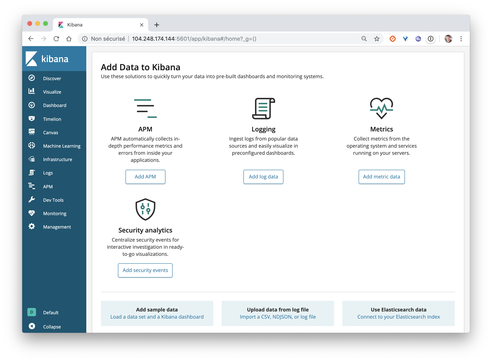
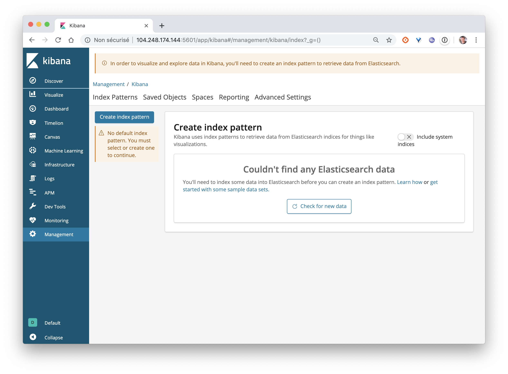
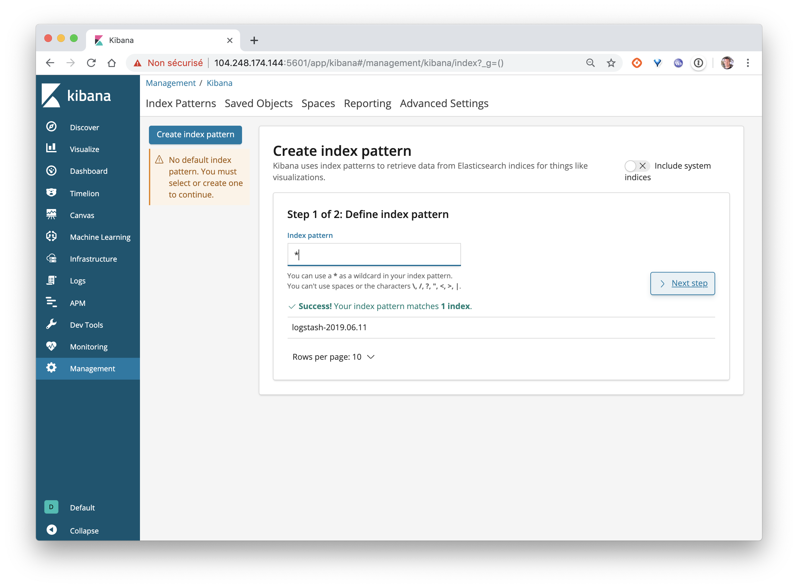
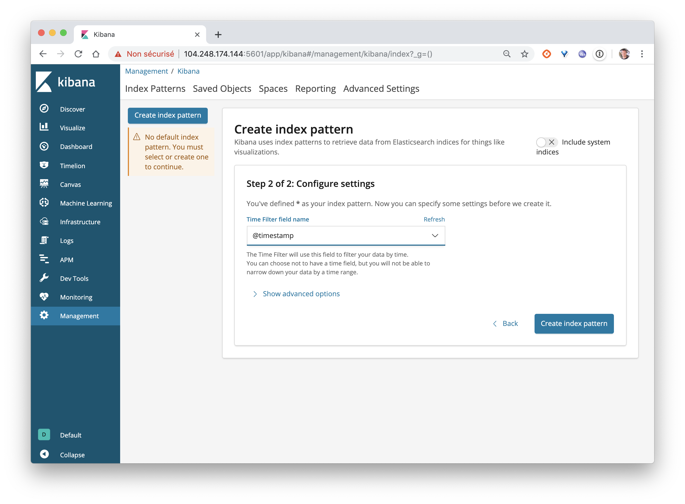
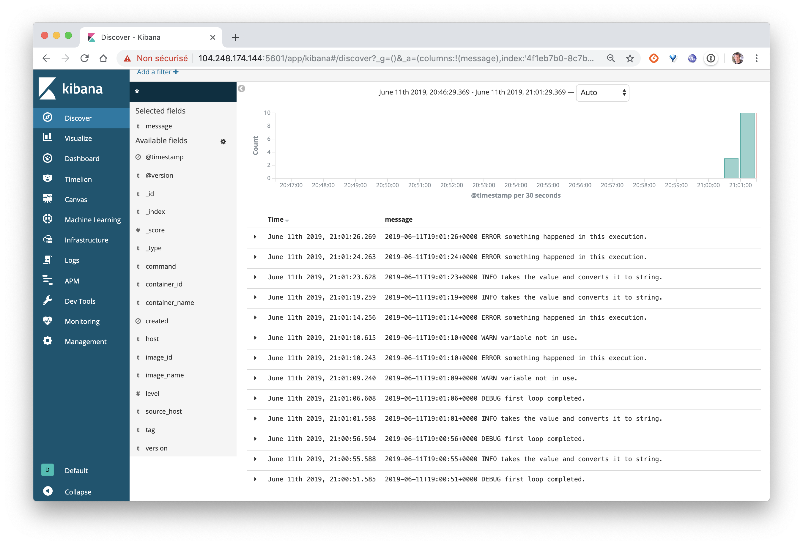

Dans cet exercice, vous allez déployer une stack Elastic et configurer le daemon docker afin que tous les logs des containers soient envoyés dans cette stack.

## Pré-requis

Pour faire cet exercice, vous aurez besoin de 2 machines virtuelles, nous appelerons la première *elastic* et la seconde *app*. Vous pouvez utiliser [Multipass](https://multipass.run) pour créér celles-ci.

```
multipass launch -n elastic
multipass launch -n app
```

## Déploiement de la stack Elastic

Lancez un shell sur la VM *elastic*, puis installer Docker:

```
$ curl -sSL https://get.docker.com | sh
```

Activer ensuite le mode Swarm:

```
$ docker swarm init
```

Dans un nouveau répertoire:

- copiez le contenu suivant dans le *logstash.conf*, ce fichier permet de configurer logstash de façon à ce qu'il écoute en UDP sur le port 12201 par défaut et à ce qu'il envoie tous les logs sur le service *elasticsearch*:

```
input {
 gelf {}
}

output {
 elasticsearch {
   hosts => ["elasticsearch:9200"]
 }
 stdout { codec => rubydebug }
}
```

- copiez le contenu suivant dans *elastic.yml*, ce fichier défini la stack Elastic afin de pouvoir la lancer sur un cluster Swarm:

```
version: '3.8'

configs:
  logstash-conf:
    file: ./logstash.conf

services:
  logstash:
    image: logstash:7.14.2
    configs:
      - source: logstash-conf
        target: /config/logstash.conf
    environment:
      discovery.seed_hosts: logstash
      LS_JAVA_OPTS: "-Xms512m -Xmx512m"
    command: ["logstash", "-f", "/config/logstash.conf"]
    ports:
      - 12201:12201/udp
  elasticsearch:
    image: elasticsearch:7.14.2
    environment:
      discovery.type: single-node
      ES_JAVA_OPTS: "-Xms512m -Xmx512m"
  kibana:
    image: kibana:7.14.2
    ports:
      - 5601:5601
```

Déployez ensuite la stack Elastic:

```
$ docker stack deploy -c elastic.yml elastic
```

Après quelques secondes, vérifiez que les services sont correctement démarrés:

```
$ docker stack services elastic

```

Vous devriez pouvoir accéder à l'interface de Kibana depuis l'IP de la VM *elasticM sur le port 5601.



Si vous sélectionnez le menu *Discover*, vous ne verrez pas de données car nous n'avons pas envoyé de logs pour le moment.



## Configuration du daemon Docker

Lancez un shell sur la VM *app*, puis installer Docker:

```
$ curl -sSL https://get.docker.com | sh
```

Créez le fichier */etc/docker/daemon.json*, de façon à ajouter les propriétés relatives au driver de log:

Note: assurez vous de remplacer HOST par l'adresse IP de la VM *elastic*:

```
{
  "log-driver": "gelf",
  "log-opts": {
    "gelf-address": "udp://HOST:12201"
  }
}
```

Redémarrez ensuite le daemon Docker:

```
$ sudo systemctl restart docker
```

## Test

Afin de vérifier que tout est bien configuré, lancez la commande suivante depuis un shell sur la VM *app*, celle-ci génére des logs de façon aléatoire:

```
$ docker run -d chentex/random-logger:latest
```

Vérifiez ensuite, sur l'interface web de *Kibana* que les logs ont bien été reçus.

Vous commencerez par la création d'un index





Puis, depuis le menu *Discover* vous pourrez visualiser les logs reçus


