# Logging sur Sumologic

Dans cet exercice, vous allez configurer le deamon Docker de façon à envoyer les logs sur la solution de gestion de logs cloud de Sumologic (https://sumologic.com).


## Création du compte Sumologic

Rendez-vous sur [https://sumologic.com](https://sumologic.com) et suivez la procédure de création de compte. Vous avez la possibilité de créer un compte gratuit, il ne sera pas nécessaire de renseigner un numéro de CB.

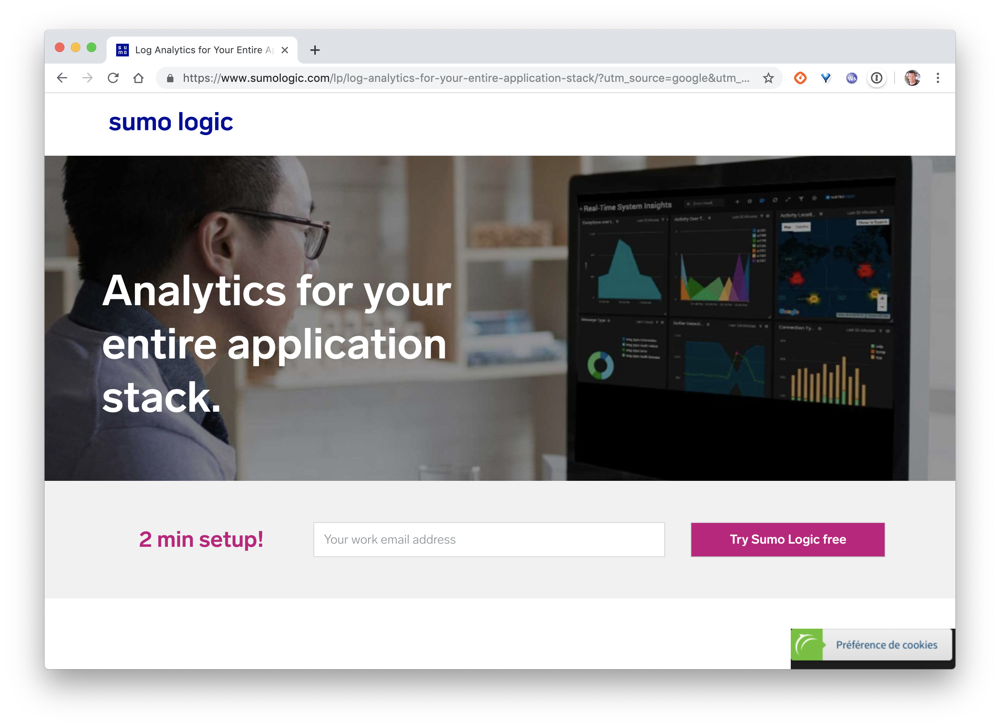

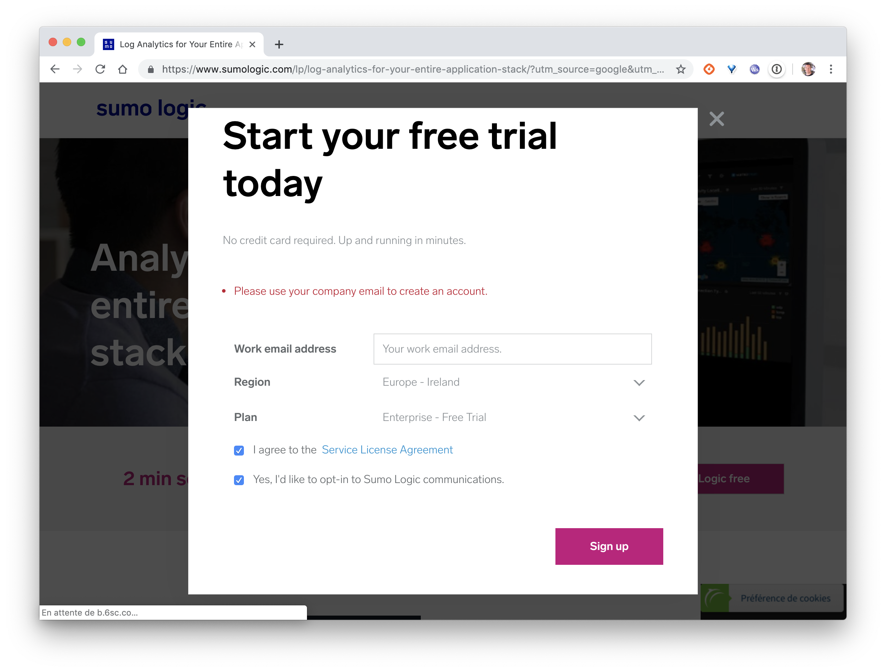

Suite à la création de votre compte, vous recevrez un email, il vous faudra valider la création et renseigner quelques informations supplémentaires.


## Création d'un collector de log

Une fois votre compte crée, vous allez suivre les étapes suivantes afin d'obtenir une URL que vous utiliserez dans la suite pour envoyer les logs.

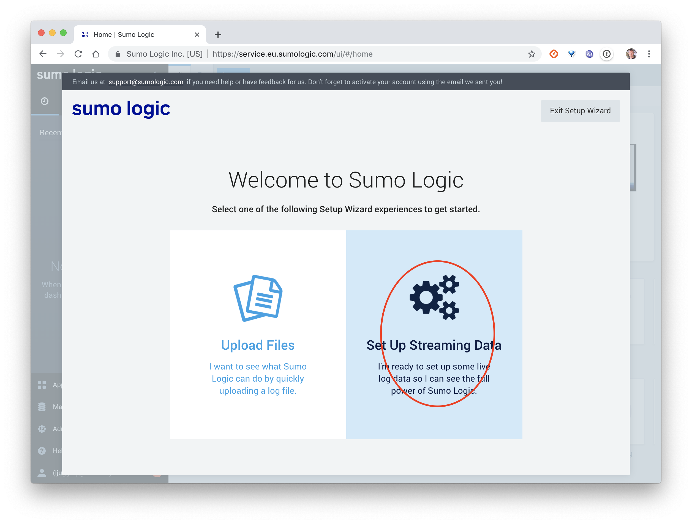

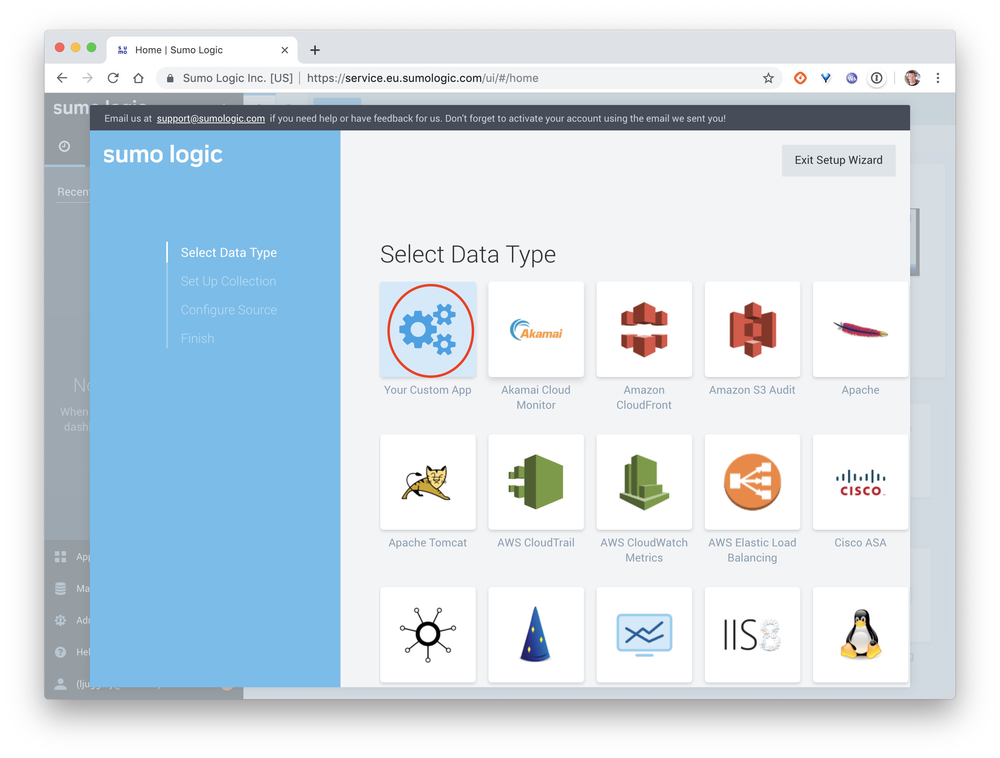

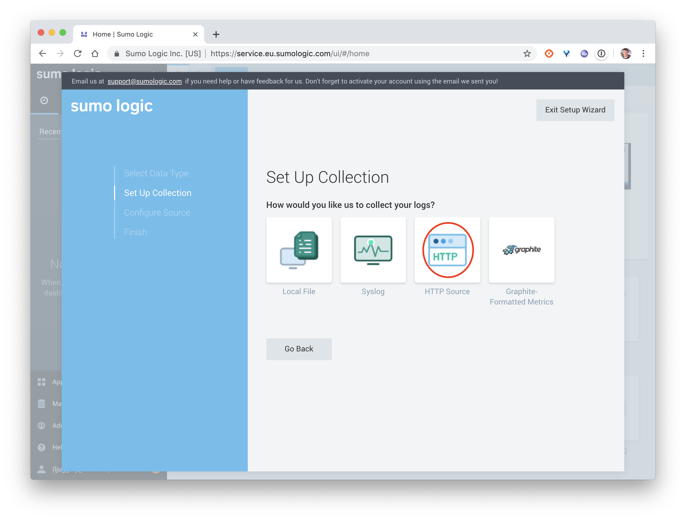

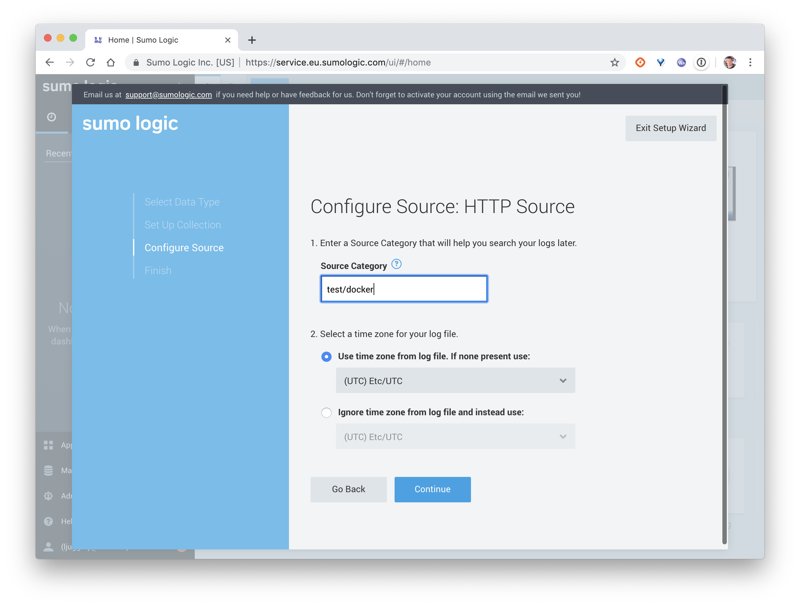

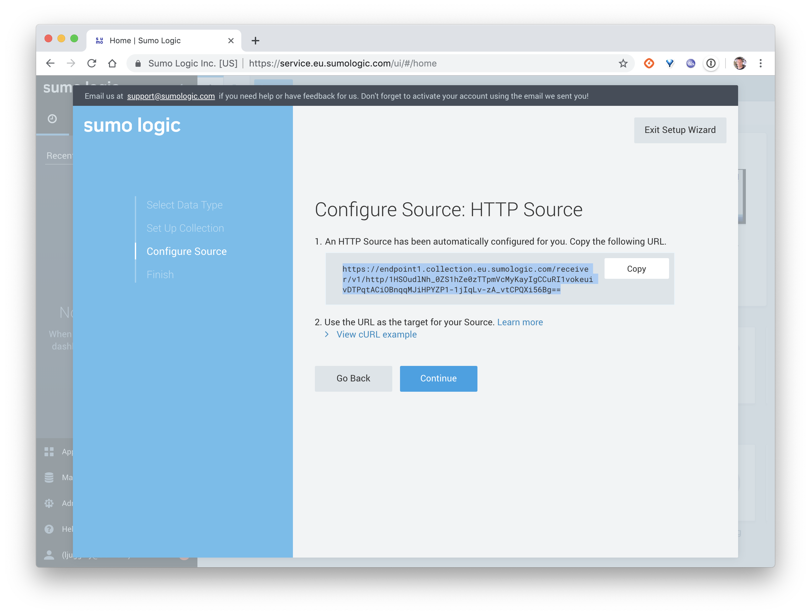

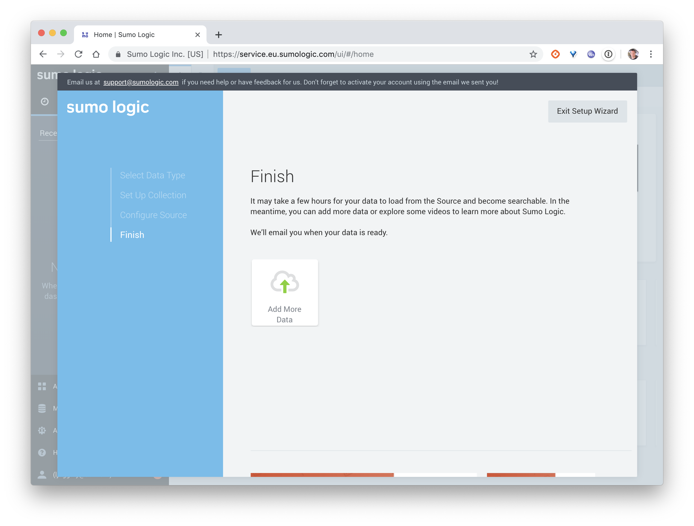


## Installation du plugin Sumologic

Depuis un hôte Docker, lancez la commande suivante afin de savoir quel driver de logging est utilisé.

```
$ docker info | grep 'Logging'
```

Vous devriez avoir un résultat indiquant que le daemon Docker utilise le driver par défaut (*json-file*).

```
Logging Driver: json-file
```

Depuis le Docker Hub, nous pouvons voir qu'il y a différents plugins disponibles dans la catégorie *Logging*.

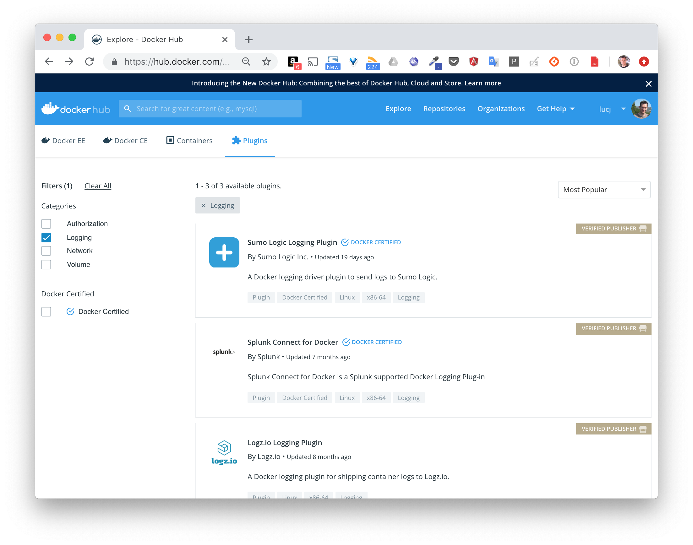

Cliquez sur le plugin *Sumologic*, vous aurez aurez alors des détails sur l'intallation et l'utilisation de ce plugin, notamment via un lien sur le repository GitHub du projet: [https://github.com/SumoLogic/sumologic-docker-logging-driver](https://github.com/SumoLogic/sumologic-docker-logging-driver).

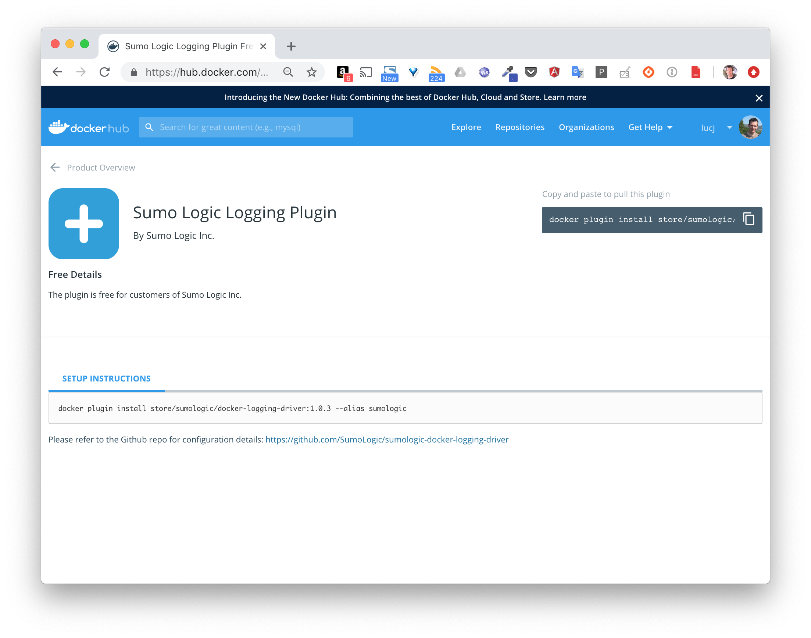

Commencez par installer le plugin en utilisant la commande suivante:

```
$ docker plugin install store/sumologic/docker-logging-driver:1.0.3 --alias sumologic
```

Vous devrez alors accepter que le plugin puisse s'attacher à la stack réseau de la machine hôte.

```
Plugin "store/sumologic/docker-logging-driver:1.0.3" is requesting the following privileges:
 - network: [host]
Do you grant the above permissions? [y/N] y
1.0.3: Pulling from store/sumologic/docker-logging-driver
bab5101cfe40: Download complete
Digest: sha256:cff846e12fd72ad0ad40faecf7980658abcd571f60d550d5692c7e4d2c5ae80d
Status: Downloaded newer image for store/sumologic/docker-logging-driver:1.0.3
Installed plugin store/sumologic/docker-logging-driver:1.0.3
```

Une fois l'installation effectuée, listez les plugins installés, le plugin *sumologic* devrait se trouver dans cette liste et être opérationnel.

```
$ docker plugin ls
ID                  NAME                DESCRIPTION                 ENABLED
b54acb6179e9        sumologic:latest    Sumo Logic logging driver   true
```


## Configuration du daemon

Maintenant que le plugin est installé, nous allons configurer le daemon Docker afin qu'il l'utilise. Nous allons pour cela créer le fichier */etc/docker/daemon.json* sur l'hôte et y définir les options suivantes.

```
{
  "log-driver": "sumologic",
  "log-opts": {
    "sumo-url": "HTTP_SOURCE_ADDRESS"
  }
}
```

Note: vous remplacerez *HTTP_SOURCE_ADDRESS* par l'URL que vous avez obtenue après avoir créé la source lors de l'étape précédente.


## Redémarrage du daemon

Pour que cette configuration soit prise en compte, il faut redémarrer le daemon.

- 1er cas

si le daemon Docker est géré par *systemd*, utilisez la commande suivante:

```
$ sudo systemctl restart docker
```

- 2ème cas:

si le daemon Docker n'est pas géré par *systemd* (par exemple si vous avez créé l'hôte sur VirtualBox avec Docker Machine), commencez par récupérer les options de lancement du daemon:

```
$ ps faux | grep dockerd
root      3920  0.1  5.2 359576 52776 ?        Sl   09:23   0:15 dockerd --data-root /var/lib/docker -H unix:// --label provider=virtualbox -H tcp://0.0.0.0:2376 --tlsverify --tlscacert=/var/lib/boot2docker/ca.pem --tlskey=/var/lib/boot2docker/server-key.pem --tlscert=/var/lib/boot2docker/server.pem --storage-driver overlay2 --pidfile /var/run/docker.pid
```

Arrêtez le daemon:

```
$ sudo kill $(cat /var/run/docker.pid)
```

ou bien avec la commande suivante si aucun fichier pidfile n'est spécifié dans les options:

```
$ sudo kill $(pidof dockerd)
```

Relancez le daemon avec les mêmes options, le fichier de configuration */etc/docker/daemon.json* sera pris en compte automatiquement.

```
$ sudo dockerd --data-root /var/lib/docker -H unix:// --label provider=virtualbox -H tcp://0.0.0.0:2376 --tlsverify --tlscacert=/var/lib/boot2docker/ca.pem --tlskey=/var/lib/boot2docker/server-key.pem --tlscert=/var/lib/boot2docker/server.pem --storage-driver overlay2 --pidfile /var/run/docker.pid
```

Faites ensuite *CTRL+Z* suivi de *bg* pour l'envoyer en tâche de fond.

Avec la commande suivante, vérifiez que le driver *sumologic* est maintenant utilisé.

```
$ docker info | grep Logging
Logging Driver: sumologic
```

## Test

Afin de vérifier que tout est bien configuré, lancez la commande suivante. Celle-ci lance un container qui écrit des logs de façon aléatoire.

```
$ docker run -d chentex/random-logger:latest
```

Vérifiez ensuite, sur l'interface web de *Sumologic* que les logs sont bien reçus.

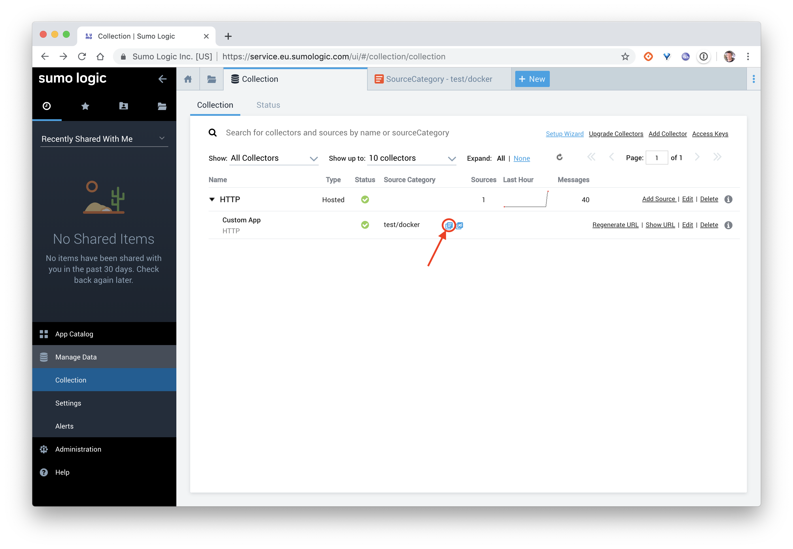

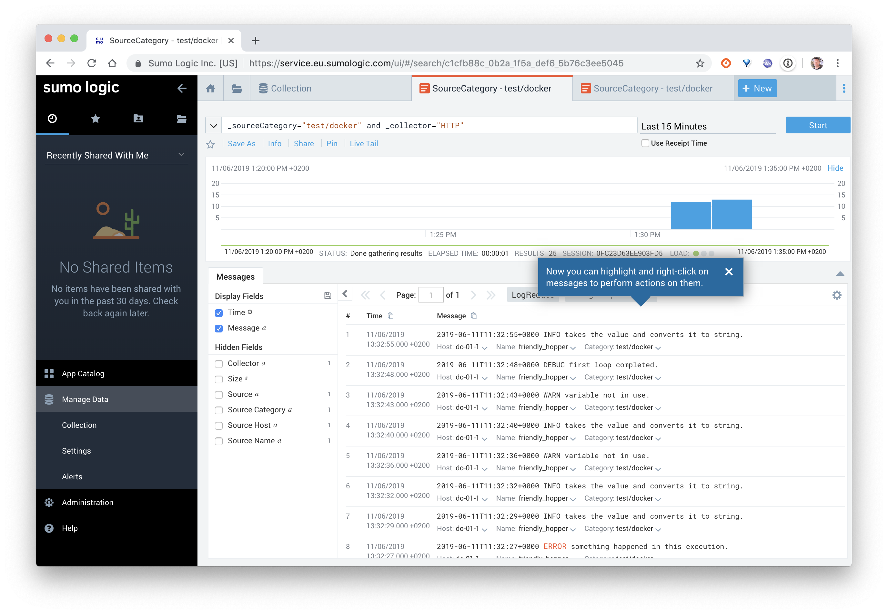

## En résumé

Nous avons vu dans cette mise en pratique qu'il est très simple d'installer un plugin de log et de configurer le daemon Docker afin qu'il utilise le driver associé.
